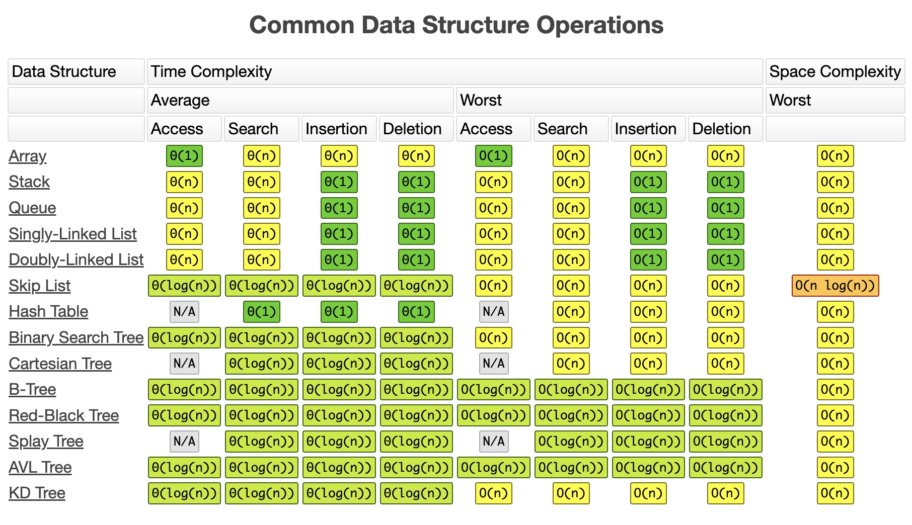

## 算法复杂度 / Big-O / 渐进分析法

- 并不需要实现
- [x] [速查表（Cheat sheet）](http://bigocheatsheet.com/)

        

 

- [x] Master Theorem
    - 解决什么问题？
        - 很多分治算法的时间复杂度可以写成 $T(n) = aT(n/b) + f(n)$; 表示把规模为n的问题拆分成a个子问题，没哥子问题规模变成 n/b；同时再递归之外还做了 $f(n)$ 的额外工作（划分，合并，扫描等）。
        - 