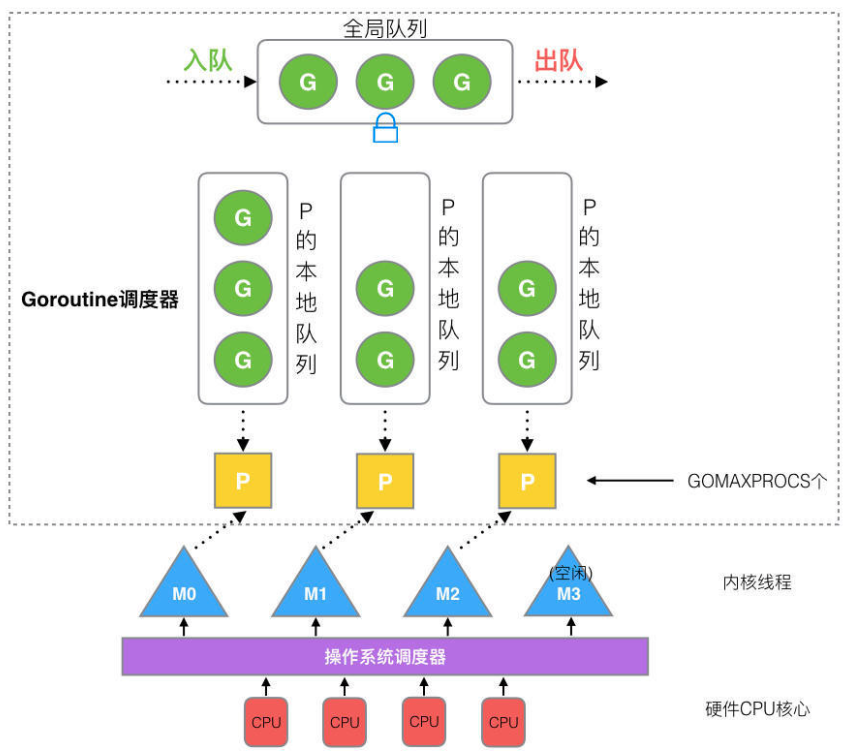
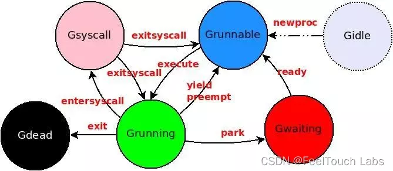

## Golang 基础

### var 和 := 的区别
    - 使用var声明变量时，需要显式指定变量的类型。
    - 如果初始化值没有提供，变量将被赋予类型的零值（例如，对于整型是0，对于字符串是""）。
    - var可以同时声明多个变量。

    - :=是Go语言的一种简写形式，用于在函数内部声明并初始化局部变量。
    - :=会自动推断变量的类型。
    - :=每次只能声明一个变量。

### new 和 make 的区别
    - new(T) 分配内存并返回指向改内存的指针，不初始化内存（存零值）
    - make 返回一个初始化之后的实例；对于内置的复合类型： slice, map, chan; make 会进行内存分配和初始化，而对其他类型，make 和 new一样，不初始化 

### defer
    - defer 用于在函数退出时释放资源： 关闭文件，释放锁
    - 如果有多个defer，按照声明的逆序执行 LIFO


### Slice 
- 扩容机制
    - go 1.17及以前：如果需要的容量>旧容量的2倍，直接扩容到期望容量；否则，如果旧容量<1024, 扩充成旧容量的两倍；否则扩充为旧容量的1.25倍
    - go 1.18及以后：如果需要的容量>旧容量的2倍，直接扩容到期望容量；否则，如果旧容量<256, 扩充成旧容量的两倍；否则每次容量增加 (旧容量 + 3 * threshold) / 4 

- Slice 的底层实现
    - 数组长度一旦确定了不可改变，slice长度可变
    - slice本身不存储数据，底层是指向数组的指针，数据存放在数组中
    ```go
    type SliceHead struct {
        Data uintptr    // 指向底层数组的指针
        Len  int        // 切片长度
        Cap  int        // 切片容量
    }
    ```
    - 扩容时新建了一个新的数组

- Golang Slice 扩容机制如果仅仅是简单的倍增（如2倍）, 如何减少内存浪费?
    - 在初始化的时候，尽量预估所需的容量，避免频繁的扩容
    ```go
    s := make([]int, length, capacity);
    ```
    - 使用append并手动控制容量 (一次性扩展所需的容量)
    ```go
    s = append(s, make([]int, 1000)...)
    ```
    - 配置更合理的增长因子
    - 使用copy合理的缩小slice的长度
    ```go
    s = s[:desiredLen]
    ```

### Interface
- 两种用法
    - 定义一组方法的集合（接口Animal），不关注具体的类型实现，只关心是否实现了某些方法；
        - 对于其他实现了相同方法的类型，都可以被入参是 Animal 类型的函数使用
        ```go
        type Animal interface {
            Speak() string
        }

        type Dog struct {}

        func (d Dog) Speak() string {
            return "Woof!"
        }

        type Cat struct {}

        func (c Cat) Speak() string {
            return "Meow!"
        }

        func MakeNoise(a Animal) {
            fmt.Println(a.Speak())
        }

        func main() {
            var dog Dog
            var cat Cat

            MakeNoise(dog) // Output: Woof!
            MakeNoise(cat) // Output: Meow!
        }
        ```

    - 空接口 interface{} 用来接受任意类型的值 (空接口不包含任何方法，因此所有类型都实现了空接口)，类似于动态类型
        ```go
        func PrintAnything(i interface{}) {
            fmt.Println(i)
        }

        func main() {
            PrintAnything(42)        // Output: 42
            PrintAnything("hello")   // Output: hello
            PrintAnything([]int{1, 2, 3}) // Output: [1 2 3]
        }
        ```
- interface 的底层实现 是通过 “接口类型和动态值” 来实现的
    ```go
    type iface struct {
        tag *itab           // data的类型信息，指向一个包含方法表（实现改接口的方法集合）的指针
        data unsafe.Pointer // 指向具体数据的指针
    }
    ```
    - 通过 动态派发机制 来实现接口调用的多态行为
        - 先通过type确定具体类型
        - 通过itab中的方法表来找到实现该接口的具体方法地址
        - 最后调用具体的实现

### map
- 内置数据结构，存储键值对
    ```go
    myMap := make(map[string][int])
    myMap["Apple"] = 2
    myMap["Banana"] = 5

    value, exist := myMap["Orange"]
    if exist {
        ...
    }

    // 遍历
    for key, value := range myMap {
        ...
    }

    // 删除
    delete(myMap, "Apple")
    ```
- Go的 map 不是并发安全的，如果在多个goroutine里同时读写同一个map，有可能导致错误
    - 解决方法：1，加一个互斥锁 sync.Mutex； 2，用并发安全的sync.Map (go 1.19 引入)
    ```go
    import (
        "sync"
    )

    func main() {
        var (
            m  = make(map[int]int)
            mu sync.Mutex
            wg sync.WaitGroup
        )

        wg.Add(2)

        go func() {
            defer wg.Done()
            for i := 0; i < 1000; i++ {
                mu.Lock()
                m[i] = i
                mu.Unlock()
            }
        }()

        go func() {
            defer wg.Done()
            for i := 0; i < 1000; i++ {
                mu.Lock()
                _ = m[i]
                mu.Unlock()
            }
        }()

        wg.Wait()
    }
    ```
- 获取map长度： len(myMap) 即可
- sync.Map不能直接使用len来捕获长度，因为sync.Map其内部结构对用户不可见，并不支持len方法
    - 可以通过range来便利sync.Map的全部元素，然后计数
    - 底层读写分离： 
        - 读操作处理只读数据结构，不加锁；写操作需要加锁
        - 两种数据结构： read存储最近的只读数据共读操作使用； 当写操作发生时候，将数据写入dirty，并在后面将dirty提升为read
    - 延迟删除： 删除操作延迟到下一次数据提升时才会真正删除
    - 适用场景：
        - 读多写少：sync.Map 在读操作远多于写操作的情况下性能最好。
        - 无须排序的并发访问：适用于无需对键进行排序或按序遍历的场景。
    - 限制：
        - 类型不安全：键和值的类型都是 interface{}，需要自行断言类型。
        - 功能有限：不支持获取长度（len），不支持按序遍历。
- map是无序的，遍历的时候元素顺序不确定
- map底层是通过Hash Table实现的
    - 解决hash冲突
        - 通过桶和溢出桶来管理键值对
            - 当多个键经过哈希后，映射到了同一个桶(即发生了哈希冲突), Go允许在同一桶中存储多个键值对：每个桶默认可以容纳8个键值对。如果继续发生冲突导致一个桶的存储空间被占满(>8)，新的键值对会被存储到该桶的溢出桶中。溢出桶形成一个链表，与原始桶相连。
        - Map查找过程：计算hash，定位桶；与桶内键数组一一比较，查找匹配的键；如果未找到且存在溢出桶，继续在溢出桶中查找
    - 自动扩容机制
        - 原因：溢出桶过多会降低查找效率
        - 装载因子 = 元素数量 / 桶数量
            - 当装载因子超过阈值(默认好像时6.5)时，触发扩容
        - 扩容后，需要重新计算所有键的hash值
        - 扩容Step 1，将桶的数量增加一倍，确保桶的数量始终是2的幂次方
        - 扩容Step 2，为避免一次性重新计算全部键的hash，采用渐进式扩容方法
            - 扩容时，map 会保留旧的桶数组（old buckets）和新的桶数组（new buckets）。
            - 在后续的插入和查找操作中，逐步将旧桶中的键值对重新哈希到新桶中。
            - 分散了重新hash的开销
- 使用普通的map加锁 与 直接用sync.map有什么区别？（分别说了使用上和性能上）
    - 使用上：
        - 普通map加锁
            - 需要显式地使用互斥锁（sync.Mutex）或读写锁（sync.RWMutex）
            - 灵活性高，可以根据需要精细的控制锁的范围
            - map的键值类型明确，不需要断言
        - sync.Map
            - 内置并发安全，不需要手动加锁，简化了代码
            - 键值类型为 interface{}，需要类型断言
            - 实现的方法与Map不同，API有限
    - 性能上
        - 普通map加锁
            - 优势：性能取决于开发人员的实现，灵活度高； 不同map结构简单，内存占用较少； map的键值类型明确，不需要断言
            - 劣势：频繁的加锁解锁会带来性能损耗，特别在高并发下； 手动管理锁容易出现死锁问题
            - 使用场景：读写均衡或者写操作较多时
        - sync.Map
            - 优势：读操作不需要加锁，性能很好；无需开发人员手动加锁，降低了并发编程的复杂性
            - 劣势：在高并发下，写性能甚至可能不如手动加锁的map，sync.Map内部结构复杂，内存开销大； 类型断言增加开销
            - 使用场景：读多写少的场景，适合快速开发

### 面试问题: Map 的key可以是哪些类型？ struct可以当作Map的key吗？
- Map的 key类型 要求必须支持 $==$ 和 $!=$ 运算，对键进行查找时需要
- 支持的类型
    - 内置类型
        - bool
        - 数字类型： int, int8, ...; uint, uint8, ...; float32, float64
        - 字符串：string
        - 指针类型：任何指针类型都可以作为map的key
    - 结构体类型
        - If 结构体的所有字段都可以比较，那么此结构体类型就可以作为map的key
    - 接口类型
        - If 接口类型的动态类型具体到可比较类型，则此接口类型可以作为map的key
- 不支持的类型
    - Slice 和 Map：都是引用类型，无法进行 $==$ 比较，因此不能作为 key
    - func : 函数类型无法比较 $==$


### channel
- 用于在goroutine之间通信，可以在不同的goroutine之间传递数据
- 无缓冲channel
    ```go
    ch := make(chan int)
    ```
    - 同步通信：发送方和接收方都会发生阻塞 -> 发送操作和接收操作时同步完成的
    - 严格的顺序保证：因为发送和接收是同步的，所以可以用于精确地控制 goroutine 之间的执行顺序
    - 阻塞：发送 ch <- value 时，如果没有可用的接收方，发送方阻塞；反之接收 value :=  <- ch 时，如果没有对应的发送方发送数据，接收方阻塞
- 有缓冲channel
    ```go
    ch := make(chan int, 3)
    ```
    - 异步通信，仅当缓冲区满了才会导致发送方阻塞，反之仅当缓冲区空了才会导致接收方阻塞
    - 缓冲区容量
- 有缓冲和无缓冲channel的区别？
    - 阻塞行为不同
    - 通信方式： 异步 （允许异步，减少阻塞，提高并发性） vs 同步（在需要严格控制顺序的场景下使用）
    - 容量： 无缓冲channel容量为0，不存储数据
- 注意事项
    - 缓冲区容量的选择
    - 避免死锁，尤其是在无缓冲channel中
    - 关闭channel：当不在需要向channel中发送数据时，应主动关闭channel
    - channel不是队列
- 如何优雅的关闭channel
    - 关闭channel的原则：
        - 只有sender应该关闭channel；同时sender应避免向关闭的channel中send数据
        - 每个chanel只能关闭一次，重复关闭会导致panic
        - 关闭通道的目的是为了通知 receiver 数据发送完毕； reveiver可以通过判断channel是否关闭来决定是否继续read from channel
    - close(ch) 关闭channel
    - 单个sender； sender直接关闭channel
    - 多个sender； 为避免重复关闭导致panic，使用WaitGroup等待所有 sender 完成后，由单独的 goroutine 关闭channel
        ```go
        import (
            "fmt"
            "sync"
        )

        func main() {
            ch := make(chan int)
            var wg sync.WaitGroup

            // 启动多个发送方
            numSenders := 3
            wg.Add(numSenders)
            for i := 1; i <= numSenders; i++ {
                go func(id int) {
                    defer wg.Done()
                    for j := 1; j <= 3; j++ {
                        ch <- id*10 + j
                    }
                }(i)
            }

            // 启动一个 goroutine 等待所有发送方完成，然后关闭通道
            go func() {
                wg.Wait()
                close(ch)
            }()

            // 接收方
            for v := range ch {
                fmt.Println("Received:", v)
            }

            fmt.Println("Channel closed, all data received.")
        }
        ```
- channel的特性
    - 类型安全
    - 双向通信: 可以用来发送和接收数据
    - 阻塞行为
- nil 是channel的零值，表示当前channel声明了但是尚未初始化
    - nil channel 既不能接收数据，也不能发送数据；所以针对nil channel的接收/发送操作都会造成永久阻塞 （goroutine asleep，知道程序崩溃或被强制终止）
    - 在select中，nil channel的操作永远不会被选择


```go
import (
    "fmt"
    "time"
)

func producer(ch chan int) {
    for i := 1; i <= 5; i++ {
        fmt.Println("生产者发送：", i)
        ch <- i // 发送数据
        time.Sleep(time.Millisecond * 500)
    }
    close(ch) // 发送完成，关闭 channel
}

func consumer(ch chan int) {
    for value := range ch { // 接收数据
        fmt.Println("消费者接收到：", value)
    }
}

func main() {
    ch := make(chan int, 3) // 有缓冲 channel

    go producer(ch)
    consumer(ch)
}
```

### 如果异步发送关闭channel信号，怎么保证channel 有序处理?
- 即怎么保证其它 goroutine 处理完了，再发送或者处理关闭信号
- 方法1：使用sync.WaitGroup可以用来等待多个goroutine执行完毕，确保在关闭channel之前，所有的goroutine都已经处理完成
```go
// sync.WaitGroup 需要作为变量传入
import (
    "sync"
    "fmt"
    "time"
)

func worker(id int, ch <- chan int, wg *sync.WaitGroup>) {
    defer wg.Done()   // 在goroutine完成时需要call Done()
    for n := range ch {
		fmt.Printf("Worker %d received %d\n", id, n)
		time.Sleep(time.Millisecond * 500) // 模拟处理时间
	}
}

func main() {
    var wg sync.WaitGroup
    ch := make(chan int)

    // 启动多个goroutine
    for i:=1; i <= 3; i++ {
        wg.Add(1)       // 注册
        go worker(i, ch, &wg)
    }

    // 发送数据到chanel
    for i:=1; i <= 3; i++ {
        ch <- i
    }

    // 关闭channel
    close(ch)

    // 等待所有goroutine 完成
    wg.wait()
}

```

# 对已经关闭的channel读写 和 对未初始化的channel读写 分别会怎么样？
- 读已关闭channel
    - 如果channel关闭前，Buffer中还有元素未读，会正确读到channel的值，且返回的 ok 为True (直到取完Buffer中的值为止)
    - 如果channel关闭前，Buffer已经为空，接下来所有读channel都会非阻塞直接成功，返回 channel 元素的零值，且 ok 一直为 False。
    ```go
    import (
        "fmt"
    )

    func main(){
        chA := make(chan int, 3)
        chA <- 1
        chA <- 2
        close(chA)
        
        num, ok := <-chA
        fmt.Printf("num: %d, ok: %v\n", num, ok)  // num: 1, ok: true

        num, ok = <-chA
        fmt.Printf("num: %d, ok: %v\n", num, ok)  // num: 2, ok: true

        num, ok = <-chA
        fmt.Printf("num: %d, ok: %v\n", num, ok)  // num: 0, ok: false
    }
    ```
- 写已关闭channel
    - 导致panic
- 读写 未初始化 的channel都会阻塞
    - 在源码 src/runtime/chan.go 中, 未初始化的channel就等于nil
    - 当 chan 不能阻塞时，会直接返回 false，表示读/写 chan 失败
    - 当 chan 能阻塞时，会直接阻塞

### select
- select中如果没有default会出现什么情况？
    - select会阻塞，直到有case可以执行
    - 需要结合实际需要，如果需要阻塞等待时候，应不使用default

- 当多个case同时就绪时，select会随机选择一个执行(避免某些通道长期得不到处理)

- case中的channel被关闭了会出现什么情况？。
    - for循环select时候，如果其中一个case channel已经关闭，则每次都会执行这个select。
        - 解决：
            - 使用 value, ok := <-chA 判断一下，当 chA 已经关闭时，ok = False, value = 0;
            - 当 ok = False时，let chA = nil, 则 <-chA 相当于读一个未初始化的channel，会一直阻塞
            - 这样当select中有任意case可以执行时，会跳过当前阻塞的这个case。 这样就解决了一直读已关闭channel的问题
    - 如果select里只有一个 case 且 channel关闭的话，会导致死循环（不停的从channel中接收到0值）
        - 使用 ok 判断一下


### panic & recover
- panic 终止当前函数执行，并（沿着函数调用栈）逐层向上返回错误信息，知道遇到revover函数或者程序终止
    - defer函数也会沿着函数调用栈逆序执行，这为recover提供了机会来捕获panic
- recover在defer函数中捕获发生的panic（recover仅在defer函数中有效，在普通函数中调用recover是无效的，返回nil）
    - recover捕获panic后，可以恢复程序正常执行
    - recover会捕获最近的一个panic值
    ```go
    func funcName() {
        defer func() {
            if r := recover(); r != nil {
                // 处理panic错误
                fmt.Println("Recovered from panic:", r)
            }
        }()
        // 可能发生panic的代码
    }
    ```
- recover和panic的实现原理
    - 底层是通过defer链表 + panic链表实现的
- 那些情况下会触发panic
    - 程序员显示调用panic抛出异常
    - Go程序发生运行时错误时会自动触发panic
        - 空指针（nil）引用
        - 数组/切片越界
        - interface{} 类型断言失败
        - 向已关闭的channel发送数据
        - 栈溢出等其他运行时错误
- 所有的panic都可以被recover捕获吗？
    - 可以被捕获的
        - 只有发生在同一个goroutine中的panic才能被recover捕获 => recover只能在引发panic的goroutine的调用栈中生效
    - 无法被捕获的
        - 不同goroutine中的panic
        - 系统级错误：如内存溢出


### Golang的GC (垃圾回收机制)
- 三色标记法 （白，灰，黑）
    - 初始时所有对象都标记为白色 （表示未被垃圾回收器访问）
    - 标记过程是：1，将根对象（全局变量，栈上的变量）标记成灰色； 2，（反复执行直到灰色对象集为空）从灰色对象集合中取一个对象，将其引用的对象标记为灰色（如果尚未验证），然后将当前对象标记成黑色
    - 此时：所有可达对象都被标记成了黑色； 白色对象就是不可达对象，可以被安全的回收
- 触发机制： 堆内存每增长100%就会触发一次
- GC缺点：GC过程占用CPU和一定的内存，频繁GC会影响性能 （尤其是在程序产生大量临时对象的时候）
    - 即时释放引用，尽量使用局部变量
    - 选择合适的数据结构，避免不必要的内存占用
    - 尽量复用对象，减少不必要的内存分配
- 混合写屏障（Hybrid Write Barrier）
    - 混合写屏障是由 Golang 在 Go 1.8 引入的，目的是确保在并发垃圾回收过程中，程序的写操作不会破坏 GC 的三色不变性。它的具体工作流程如下：
    - 写操作：每当程序执行写操作（例如将某个指针写入到某个对象中时），写屏障会介入。
    - 屏障拦截：写屏障在写操作发生时，会首先检查被写入的目标对象。如果目标对象尚未被标记为灰色，它会将其标记为灰色，并将其放入标记队列中。
    - 并发执行：标记阶段和写操作并发执行时，混合写屏障会持续工作，直到标记阶段完成。
    - 作用于 并发标记阶段

### reflect - 反射
- reflect允许go程序在运行时检查变量类型和值
    - 处理interface{}接口类型
    ```go
    import "reflect"

    var x = 123
    t := reflect.TypeOf(x)
    v := reflect.ValueOf(x)
    ```
- reflect允许获取和修改结构体的全部字段和方法
    - 可以用来动态调用函数
    ```go
    type Person struct {
        Name string
        Age  int
    }

    func (p Person) SayHello() {
        fmt.Printf("Hello, my name is %s.\n", p.Name)
    }

    func main() {
        p := Person{Name: "Alice", Age: 30}
        v := reflect.ValueOf(p)   // get all value in struct Person

        for i := 0; i < v.NumField(); i++ {
            field := v.Field(i)
            fmt.Printf("Field %d: %v\n", i, field)
        }

        method := v.MethodByName("SayHello")   // get func based on name
        method.Call(nil)
    }
    // print
    // Field 0: Alice
    // Field 1: 30
    // Hello, my name is Alice
    ```
- 注意 直接通过reflect.ValueOf(x)获取的Value通常是不可修改的，因为它是一个值拷贝
    - 可以通过指针的方式去修改
    ```go
    var x = 10
    v := reflect.ValueOf(&x)    // 获取x的指针
    v := v.Elem()               // 获取指针指向的值
    if v.CanSet() {
        v.SetInt(20)
    }
    ```
- 反射的实际应用 (序列化和反序列化： encoding/json)
    ```go
    import (
        "encoding/json"
        "fmt"
    )

    type Person struct {
        Name string `json:"name"`
        Age  int    `json:"age"`
    }

    func main() {
        jsonData := `{"name": "Charlie", "age": 28}`
        var p Person
        err := json.Unmarshal([]byte(jsonData), &p)
        if err != nil {
            fmt.Println("Error:", err)
            return
        }
        fmt.Println("Person:", p)
    }
    ```
- reflect 如何获取字段tag
    - 可以通过 t.Field(i).Tag.Get("json") 和 t.Field(i).Tag.Get("otherTag") 来读取字段tag
    ```go
    type J struct {
        a string //小写无tag
        b string `json:"B"` //小写+tag
        C string //大写无tag
        D string `json:"DD" otherTag:"good"` //大写+tag
    }

    func printTag(stru interface{}) {
        t := reflect.TypeOf(stru).Elem()    // 获取值对应的结构体内容
        for i := 0; i < t.NumField(); i++ {
            fmt.Printf("结构体内第%v个字段 %v 对应的json tag是 %v , 还有otherTag？ = %v \n", 
            i+1, 
            t.Field(i).Name, 
            t.Field(i).Tag.Get("json"),         // json tag
            t.Field(i).Tag.Get("otherTag"))     // otherTag
        }
    }
    ```


### json包使用时，结构体的变量下不加tag能不能正常转为json的字段
- 如果变量首字母小写，则为private，无论如何不能转，因为取不到反射信息
- 如果变量首字母大小，则为public
    - 不加tag，可以正常转为json里的字段，json内字段名和结构体内字段原名一致
    - 加tag，从 struc 转为json的时候，json的字段名就是tag里的名字，原字段名不再使用
```go
import (
    "encoding/json"
    "fmt"
)
type J struct {
    a string             //小写无tag
    b string `json:"B"`  //小写+tag
    C string             //大写无tag
    D string `json:"DD"` //大写+tag
}
func main() {
    j := J {
    a: "1",
    b: "2",
    C: "3",
    D: "4",
    }
    fmt.Printf("转为json前j结构体的内容 = %+v\n", j)
    jsonInfo, _ := json.Marshal(j)
    fmt.Printf("转为json后的内容 = %+v\n", string(jsonInfo))
}
// 输出
// 转为json前j结构体的内容 = {a:1 b:2 C:3 D:4}
// 转为json后的内容 = {"C":"3","DD":"4"}
```
- json包里不能导出私有变量的tag是因为json包里认为私有变量为不可导出的Unexported


### context.Context
- 用于在goroutine之间传递上下文信息，包括取消信号，截止时间，超时以及键值对等
- 主要功能：
    - 取消正在进行测操作： Cancellation，当父goroutine不再需要某个操作结果时，可以通知相关的子goroutine停止执行，节省资源
    - Timeout控制
    - 在不同函数和goroutine之间传递请求相关的数据
- 适用场景
    - 网络请求的处理： 在处理HTTP请求时，可以使用Context在请求链路中传递取消信号和元数据
    - 长时间运行的任务：通过Context控制生命周期，防止资源泄露
    - 并发控制： 必要时方便通知所有相关的goroutine停止执行


## 并发相关
### goroutine
- goroutine是一种 user-level thread, 创建和销毁的成本很低，可以在同一个进程中轻松创建数以万计的goroutine
- 使用 go 关键字启动一个新的goroutine
- 特点
    - 轻量级：初始栈空间仅2KB，随着goroutine的执行，栈大小可以动态增长和收缩
    - 独立性：每个goroutine都有独立的栈空间和PC(程序计数器)
    - 调度：Go的运行时调度器负责在操作系统线程上多路复用goroutine
- 如何让goroutine等待
    - 使用 sync.WaitGroup
    - 使用 channel
    - 使用 context
        - 创建带取消的ctx, 在gorouting中监听ctx.Done(), 然后再主goroutine中调用cancel()
        ```go
        ctx, cancel := context.WithCancel(context.Background())

        func child(ctx context.Context) {
            select {
            case <-ctx.Done():
                // 接收到取消信号，退出
                return
            default:
                // 继续执行任务
            }
        }

        func main() {
            ...
            cancel()
        }
        ```

### goroutine调度器：GMP模型
- M - Machine, 表示kernel-level thread, 由操作系统管理，一般数量等于CPU核心数
- P - Processor， 表示逻辑处理器，数量由 $GOMAXPROCS$ 决定， 默认值为CPU核心数
    - 每个P都有自己的本地队列；
- G - Goroutine  (参与调度和执行的最小单位)
- 调度流程如下：
    - 线程 M 想运行任务就需得获取 P，即与 P 关联；关联后 M 优先从P的本地队列（LRQ）中获取 G
    - 若LRQ中没有可运行的G，M 会尝试从全局队列(GRQ)拿一批 G 放到P的本地队列
    - 若全局队列也未找到可运行的 G，M会随机从其他 P 的本地队列取一半放到自己 P 的本地队列。
    - 拿到可运行的G之后，M 运行 G，G 执行之后，M 会从 P 获取下一个 G，不断重复下去。
- 优势
    - G的创建和切换成本低，调度器在用户态完成，大大提高了并发性能
    - 开发者无需手动管理线程



- goroutine的状态机




### 同步机制
- sync.WaitGroup 用于等待一组goroutine完成
- sync.Mutex 互斥锁，用于在多个goroutine之间保护共享资源，防止竞争冲突
    ```go
    var mu sync.Mutex

    mu.Lock()
    // 访问共享资源
    mu.Unlock()
    ```
- sync.RWMutex  读写锁，允许多个读同时进行，对写操作进行独占
    ```go
    var rwMu sync.RWMutex

    rwMu.RLock()
    // 读共享资源
    rwMu.RUnlock()

    rwMu.Lock()
    // 写操作
    rwMu.Unlock()
    ```
- Conditional variable 用于goroutine之间的通知和等待，也可以通过channel
    ```go
    var cond = sync.NewCond(&sync.Mutex{})

    cond.L.Lock()
    // 等待条件满足
    cond.Wait()
    cond.L.Unlock()

    // 通知等待的goroutine
    cond.Signal()  // 通知一个
    cond.Broadcast() // 通知所有
    ```
- sync/atomic包提供了一些底层的原子操作，支持对整型，指针等类型的原子读写


### Go中怎么实现并发的？
- 通过goroutine + GMP实现轻量级线程 + 线程调度
- 通过channel进行goroutine之间的通信
- 同步机制如WaitGroup、Mutex、atomic等，提供了对共享资源的安全访问。


## Golang程序debug
### 有什么办法可以获得函数调用的链路？
- 通过 runtime/debug 包可以打印堆栈信息
    - debug.PrintStack() 会打印当前 goroutine 的堆栈跟踪信息，包括函数名、文件名、行号等。
    ```go
    package main

    import (
        "runtime/debug"
    )

    func main() {
        functionA()
    }

    func functionA() {
        functionB()
    }

    func functionB() {
        debug.PrintStack()
    }
    ```

### 怎么处理协程运行的超时问题？
- 使用context包的超时和取消功能
```go
import (
    "context"
    "fmt"
    "time"
)

func main() {
    var wg sync.WaitGroup

    ctx, cancel := context.WithTimeout(context.Background(), 2*time.Second)  // 带超时信息的context
    defer cancel()

    go func(ctx context.Context) {
        for {
            select {
            case <-ctx.Done():   // 监听ctx.Done()
                fmt.Println("协程收到取消信号，退出")
                return
            default:
                // 模拟工作
                fmt.Println("协程工作中...")
                time.Sleep(500 * time.Millisecond)
            }
        }
    }(ctx)
    wg.Add(1)

    // 等待协程处理
    wg.Wait()
    fmt.Println("主函数退出")
}
```

### 如何限制goroutine的数量
- goroutine虽然light-weight, 但是大量阻塞的goroutine可能导致性能下降，调度器的开销增加
- 使用有缓冲的channel作为信号量(semephore)，限制同时运行的goroutine数量
    - 向channel中发送令牌，goroutine获取令牌后才能执行，执行完毕后归还令牌
- 使用 work pool来处理，预先启动固定数量的work，每个work从chanel中获取任务执行。

### goroutine泄漏？怎么避免和排查goroutine泄漏的问题？
- goroutine泄露即goroutine无法正常退出（阻塞状态），会持续占用内存和其他资源
- 原因有哪些？
    - goroutine中执行对channel的读或写操作，但channel为空或者channel已满，goroutine会被阻塞
    - 未在goroutine中监听上下文的取消信号（context.Context），导致无法及时推出
    - 多个goroutine相互等待资源，导致死锁
    - goroutine中有代码错误：无限循环
    - 为正确关闭channel，导致receiver持续等待数据
- 如何避免：

- 如何排查：
    在pprof交互界面中，可以使用goroutine命令查看goroutine的堆栈信息，找出未退出的goroutine。

### golang程序hang住了可能是什么原因（说了可能死循环导致无法GC，golang1.13），怎么排查（可以用pprof）
- 死循环导致无法GC (GC无法抢占执行)
- 死锁
- 阻塞操作未执行
- Goroutine泄露导致性能下降甚至卡死


### golang的内存拷贝
- 只要是发生类型强制转换都会发生内存拷贝
- go中将字符串转换成[]byte数组时，发生了类型转换（go中string时不可变的，[]byte是可变的，为了保证string的不可变性，copy了一个新的字节数组）
    - 其实 slice 的struct 底层通过uintptr指向 数组，string也是一样的。
    - 可以通过unsafe包将指针地址进行copy来避免内存拷贝，但这是不安全的


### Golang 的内存逃逸
- golang程序变量会携带有一组校验数据，用来证明它的整个生命周期是否在运行时完全可知。如果变量通过了这些校验，它就可以在栈上分配。否则就说它 逃逸 了，必须在堆上分配。  (逃逸： 栈空间 -> 堆空间)
- 哪些情况下会发生？
    - 在方法中将局部变量的指针组为返回值
        - 指针被外部引用，导致其声明周期大于func的栈空间，溢出到堆上
    - 发送指针或者带有指针的值到channel中
        - 在编译时无法知道哪个goroutine会在channel上接收数据，所以编译器无法知道合适释放
    - 在一个Slice上存储指针或者带指针的值
        - 例如 []*string, 尽管背后的数组在栈上，但是引用的值肯定在堆上
    - Slice背后数组被重新分配(append 超过了cap)
        - slice最开始初始化在栈上，当背后的数组需要扩充之后，就会在堆上分配
    - 在interface上调用方法
        - 动态调度
- 怎么查看逃逸的情况
    ```shell
    go build --gcflags=-m sample.go # 可以查看逃逸情况
    ```


### 翻转含有中文，数字，英文字母的字符串
- rune关键字，从 golang 源码中看出，它是 int32 的别名（-2^31 ~ 2^31-1），比起 byte（-128 ～ 127），可表示更多的字符。
- 由于 rune 可表示的范围更大，所以能处理一切字符，当然也包括中文字符。在平时计算中文字符，可用 rune。

```go
import "fmt"

func reverse(s []rune) []rune {
    for i, j := 0, len(s) - 1; i < j; i, j = i+1, j-1{
        s[i] s[j] = s[j], s[i]
    }
    return s
}

func main() {
    src := "你好abc123"
    dst := reverse([]rune(src))
    fmt.print("%v\n", string(dst))
}
```


### 为sync.WaitGroup实现一个timeout功能
```go
func main() {
	wg := sync.WaitGroup{}
	c := make(chan struct{})
	for i := 0; i < 10; i++ {
		wg.Add(1)
		go func(num int, close <-chan struct{}) {
			defer wg.Done()
			<-close
			fmt.Println(num)
		}(i, c)
	}

	if WaitTimeout(&wg, time.Second*5) {
		close(c)
		fmt.Println("timeout exit")
	}
	time.Sleep(time.Second * 10)
}

func WaitTimeout(wg *sync.WaitGroup, timeout time.Duration) bool {
	// 要求手写代码
	// 要求sync.WaitGroup支持timeout功能
	// 如果timeout到了超时时间返回true
	// 如果WaitGroup自然结束返回false
	ch := make(chan bool, 1)

	go time.AfterFunc(timeout, func() {
		ch <- true
	})

	go func() {
		wg.Wait()
		ch <- false
	}()
	
	return <- ch
}
```

### golang的nil切片 和 空切片的区别？
- nil slice
    - 未初始化的slice，其值为nil； var s []T
    - 长度和容量都为0
    - nil slice的底层数组指针也是nil
- 空slice
    - 初始化了，但是长度和容量为0的slice
    - 空slice的底层数组指针指向一个分配的内存区域（但没有存储数据）
    - make([]T,0) 或者 []T{} 都会生成一个空 slice
    - 注意：空切片底层数组指向的地址指向的是一个固定值，既所有空切片都指向这个地址

### 分析输出
```go

type Student struct {
    Name string
}

func main() {
    fmt.Println(&Student{Name: "menglu"} == &Student{Name: "menglu"})  // false  指针
    fmt.Println(Student{Name: "menglu"} == Student{Name: "menglu"})    // true   值
}


func main() {
    fmt.Println([...]string{"1"} == [...]string{"1"}) // true, 比较的是数组
    fmt.Println([]string{"1"} == []string{"1"}) // invalid, slice不支持比较
}

// 下面 在for循环里append会造成死循环吗？
func main() {
	s := []int{1,2,3,4,5}
	for _, v:=range s {
		s =append(s, v)
		fmt.Printf("len(s)=%v\n",len(s))
	}
}
// 答： 不会，因为for range 在循环开始前会获取切片长度，然后再执行循环体
```


### 切片大小对于切片拷贝的开销有影响吗？
- 没有
- 所有切片的大小相同：一个uintptr，2个int
```go
type SliceHeader struct {
    Data uintptr
    Len int
    Cap int
}
```