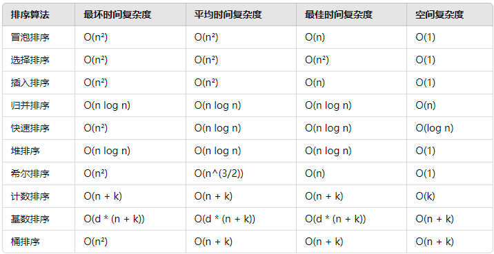

### 数组查找的时间复杂度是多少，为什么？
- 数组查找的复杂度取决于你使用的查找方式以及数组是否有序
- 线性查找
    - O(n)
    - 适用于无序数组 或 不知道数组是否有序的场景
- 二分查找
    - O(log n)
    - 只适用于有序数组
- 哈希查找
    - O(1) - 平均情况； 因为hash冲突，极端情况下可能会退化为 O(n)
    - 适合需要快速查找特定元素且不关心元素顺序的场景
- 跳表查找
    - O(log n)
    - 跳表是一种平衡数据结构，允许进行二分查找；在每一层，跳表通过跳过一些节点来减少查找的元素数量
    - 适用于动态插入、删除

### 排序算法
- 冒泡排序
    - 相邻元素凉凉比较，如果顺序错误则交换，直到没有需要交换的元素
- 选择排序
    - 每次从未排序部分中找到最小（或最大）元素，并将其放到已排序部分的末尾。
- 插入排序
    - 从第二个元素开始，依次将每个元素插入到前面已排序部分的正确位置
- 归并排序
    - 将数组分成两半，分别排序，然后将它们合并。归并排序是一种稳定的排序算法。
- 快速排序
    - 选择一个枢轴，将数组分成小于枢轴和大于枢轴的两部分，递归地排序这两部分。
- 堆排序
    - 基于堆数据结构，通过将无序数组构造成一个堆，然后依次取出堆顶元素形成有序数组。
- 桶排序
    - 将数据分配到多个桶中，每个桶内再分别排序，最后将桶内的结果合并。

### 不同的树结构，以及各自的优缺点

