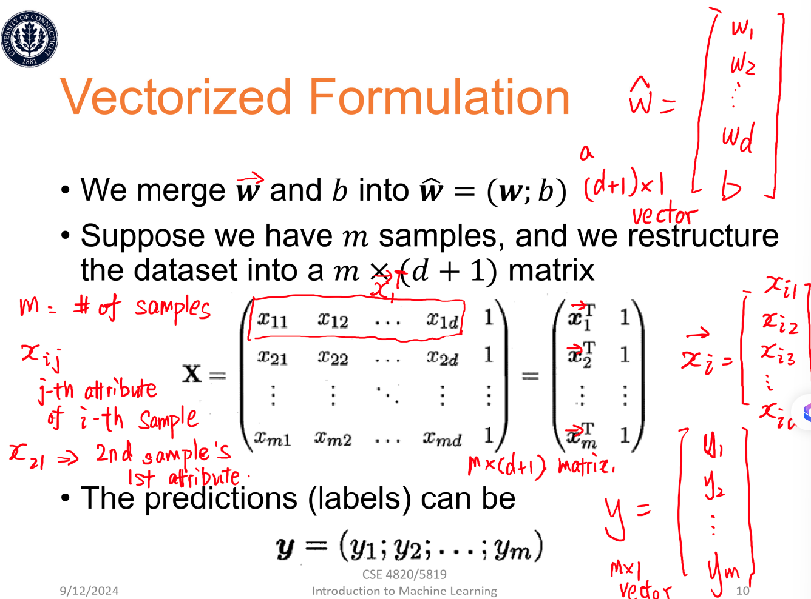

# Linear Regression
- Regression: predict a value of a real-valued variable based on the value of other variables.
- linear or nonlinear

### Linear model
- Definition
$ y = b + \sum_{} w_{j} x_{j} $

$ x_{j} \text{: value of feature } $
$ w_{j} \text{: weight} $
$ b \text{: bias} $

- Use Matrix
    - Given d differnet attributes
    $f(x) = b + w_{1}x_{1} + w_{2}x_{2} + ... + w_{d}x_{d}$
    - write as $f(x) = b + X^{T}W$
        where $W = (w_{1}, w_{2}, ..., w_{d})$ and $X = (x_{1}, x_{2}, ..., x_{d})$

- The goal is to obtain the W and b
    - merge W and b into $\widehat{W} = (W; b) = (w_{1}, w_{2}, ..., w_{d}, b)^{T}$
    - Suppose we have m samples
    

### Least Squares:
- Optimization View
    - Problem: to use some real-valued input variables x to predict the value of a target y
    - Procedure:
        - collect training data: pairs $(x_{i}, y_{i}) \text{, for i = 1, ..., m}$
        - Hypothesis space(假设空间): suppose we have a model $\mathcal{f}$ that maps each sample $x_{i}$ to the value of $y_{i}$
            $f(x_{i}|\widehat{W}) = \widehat{y_{i}}$
    - Method: minimize the sum of squares("least squares")
        - Sum of the squares of the deviation between the observed target value y and the predicted value $\widehat{y}$
        $$
        \sum_{i=1}^{m}(y_{i} - \widehat{y_{i}})^{2} = \sum_{i=1}^{m}(y_{i} - f(x_{i}|\widehat{W}))^{2}
        $$

        - **Find a function $\mathcal{f}$ such that the sum of squares is minimized**.
        $$
        \min_{\widehat{W}}\sum_{i=1}^{m}(y_{i} - f(x_{i}|\widehat{W})^{2})
        $$
- Linear Regression & Polynomial Regression(多项式回归)
    - Linear
    $$
    \min_{\widehat{W}}\sum_{i=1}^{m}(y_{i} - X_{i}^{T}\widehat{W})^{2}
    $$

    - Polynomial
        $$
        \min_{\widehat{W}}\sum_{i=1}^{m}(y_{i} - \phi(x_{i})^{T}\widehat{W})^{2}
        $$
        - Node: polynomical function 
        $y = w_{1}x + w_{2}x^{2} + w_{3}x^{3} + ...$ 即可以表示为： $\phi(x) = (x, x^{2}, x^{3}, ...)^{T}$

### More General Cases
- $\mathcal{L}(\widehat{W})$ is the Loss/objective function
    
    $$
    \begin{align}
    \mathcal{L}(\widehat{W})  
    &= \min_{\widehat{W}}\sum_{i=1}^{m}(y_{i} - X_{i}^{T}\widehat{W})^{2} \\
    &= \min_{\widehat{W}}\sum_{i=1}^{m}(y_{i} - X_{i}^{T}\widehat{W})^{T}(y_{i} - X_{i}^{T}\widehat{W}) \\
    &= (y - X\widehat{W})^{T}(y - X\widehat{W}) \\
    &= (y^{T} - \widehat{W}^{T}X^{T})(y - X\widehat{W}) \\
    &= y^{T}y - y^{T}X\widehat{W} - \widehat{W}^{T}X^{T}y + \widehat{W}^{T}X^{T}X\widehat{W}
    \end{align}
    $$
    
- 其中，因为 $y$, $X$, $\widehat{W}$ 的 dimension 分别是 (m, 1); (m, d+1); (d+1, 1); 所以 $y^{T}X\widehat{W}$ 和 $\widehat{W}^{T}X^{T}y$ 都是一个scalar. 继续有：
    $$
    \begin{align}
    \mathcal{L}(\widehat{W})  
    &= y^{T}y - 2y^{T}X\widehat{W} + \widehat{W}^{T}X^{T}X\widehat{W}
    \end{align}
    $$

- 求导(Gradient),并使导数为0 => convex function + minimize
    $$
    \begin{align}
    \frac{\partial L(\widehat{W})}{\partial \widehat{W}}
    &= 0 - 2y^{T}X + 2\widehat{W}^{T}X^{T}X = 0 \\

    \text{>>} \widehat{W}^{T}X^{T}X &= y^{T}X \\
    
    \text{transpose both >>} X^{T}X\widehat{W} &= X^{T}y \\

    \text{>>} \widehat{W} = (X^{T}X)^{-1}X^{T}y

    \end{align}
    $$

- Note: **the funtion (10) is very important!!!**

### Gradient Descent
- 对每个 $w_{i}$ 和 $b$ 计算导数，并update the weights based on that.
- Possible Termination Rules
    - If the function value of $L(\widehat{w})$ does not change any more with the iterations
    $\left| L\left(\widehat{w}^{k+1}\right) - L\left(\widehat{w}^{k}\right) \right| < \varepsilon$

    - If the magnitude of the gradient is small enough
    $\left\| \nabla L\left(\widehat{w}^{k+1}\right) \right\| < \varepsilon$

    - If the difference between the two consecutive iterates is small enough
    $\left\| \widehat{W}^{k+1} - \widehat{W}^{k} \right\| < \varepsilon$

- Different Choice
    - Batch Gradient Descent
        - the batch here means the entire dataset
    - Stochastic Gradient Descent (SGD)
        - picks a random instance in the training set at every step and compute the gradients based only on that single instance.
        - less regular than Batch GD
        - help jump out of local minima
        - gradually reducing the learning rate
    - Mini-Batch Gradient Descent
        - get a performance boost from hardware optimization of matrix operations

### Generalization
- What we really care about is the error on new data(testing data)
- Overfitting
    - A more complex model does not always lead to better performance on testing data.
    - How to solve:
        - select suitable model
        - regularization(*)

### Regularization
- A regularizer is an additional criteria to the loss function to make sure that we do not overfit: $\lambda*r(W,b)$
- Common Regularizers
    - Sum of the weights $r(\widehat{W}) = \sum(|w_{j}|)$
    - Sum of the squared weights $r(\widehat{W}) = \sum(|w_{j}|^{2})$
    - L2-Norm:
        $$
        \sqrt{\sum \left|w_{j}\right|^{2}}
        $$
    - P-Norm: 注意这里开P次方
        $$
        \sqrt{\sum \left|w_{j}\right|^{p}}
        $$
