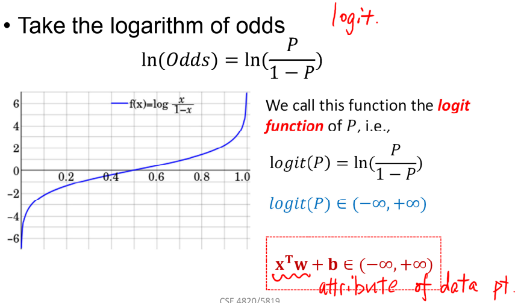

# Logistic Regression
- Classification

### The logistic regression model solves these problems:
$$
ln(\frac{p}{1-p}) = x^{T}W + b
$$
where p is the probability that an event occurs.
- $\frac{p}{1-p}$ is the odds ratio, $p \in (0, 1)$
- $ln(\frac{p}{1-p})$ is the log odds ratio, or logit

### The estimated probability
-The logistic distribution constrains the estimated probabilities to lie between 0 and 1.
- The estimated probability (using $\widehat{y}$ in the place of $p$; and $z = x^{T}W + b$)
$$
p = \widehat{y} = \frac{1}{1 + \exp(-z)} = \frac{1}{1 + \exp(-(x^{T}W + b))}
$$ 
- if let $x^{T}W + b = 0$, get $p = \widehat{y} = 0.5$
- As $x^{T}W + b$ gets really big, p approaches 1
- As $x^{T}W + b$ gets really small, p appraoches 0
- ***Sigmoid function***

### Logistic regression
- Find a function f (Linear function of $x_i$ parameterized with $W, b$: $x_{i}^{T}W + b$) that best predicts the probability $p = \widehat{y}$
    - $p \in [0,1]$, However, $x_{i}^{T}W + b \in (-\infty, +\infty)$

- Further Transformation (the log odds ratio, or logit)
    - $p = \widehat{y} = \frac{1}{1 + \exp(-(x^{T}W + b))}$ is probability, and $\widehat{y} \in (0, 1)$
    $$
    \begin{align}
    1 - \widehat{y} 
    &= \frac{1 + \exp(-(x^{T}W + b))}{1 + \exp(-(x^{T}W + b))} - \frac{1}{1 + \exp(-(x^{T}W + b))} \\
    &= \frac{\exp(-(x^{T}W + b))}{1 + \exp(-(x^{T}W + b))} \\

    \frac{\widehat{y}}{1 - \widehat{y}} 
    &= \frac{\frac{1}{1 + \exp(-(x^{T}W + b))}}{\frac{\exp(-(x^{T}W + b))}{1 + \exp(-(x^{T}W + b))}} 
    = \frac{1}{\exp(-(x^{T}W + b))}
    = \exp(x^{T}W + b) \\

    ln(\frac{\widehat{y}}{1 - \widehat{y}}) &= ln(\exp(x^{T}W + b)) = x^{T}W + b
    \end{align}
    $$

- Conection between Linear regression and Logistic regression
    $$
    Odds(P) = \frac{P(y_{i}=1|x_{i})}{P(y_{i}=0|x_{i})} = \frac{P(y_{i}=1|x_{i})}{1 - P(y_{i}=1|x_{i})} = \frac{p}{1-p} 
    $$
    
