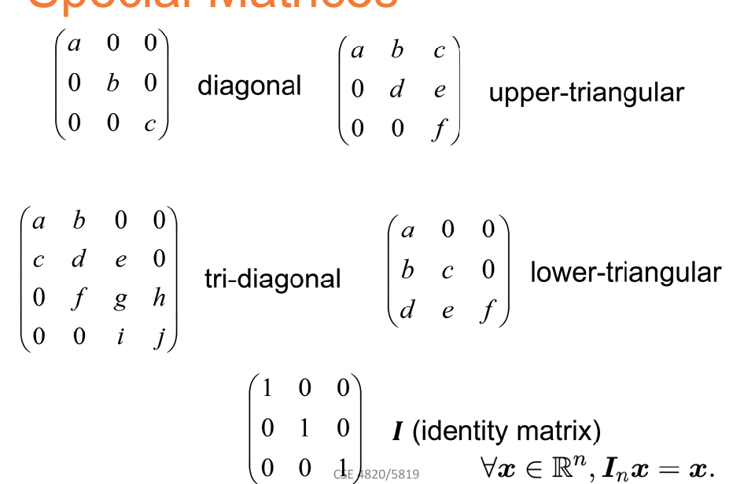
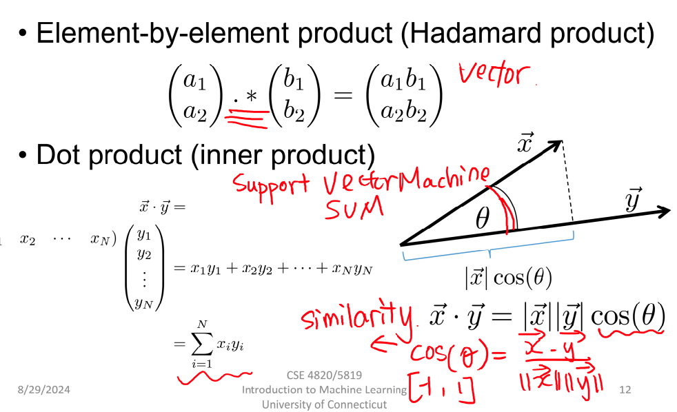
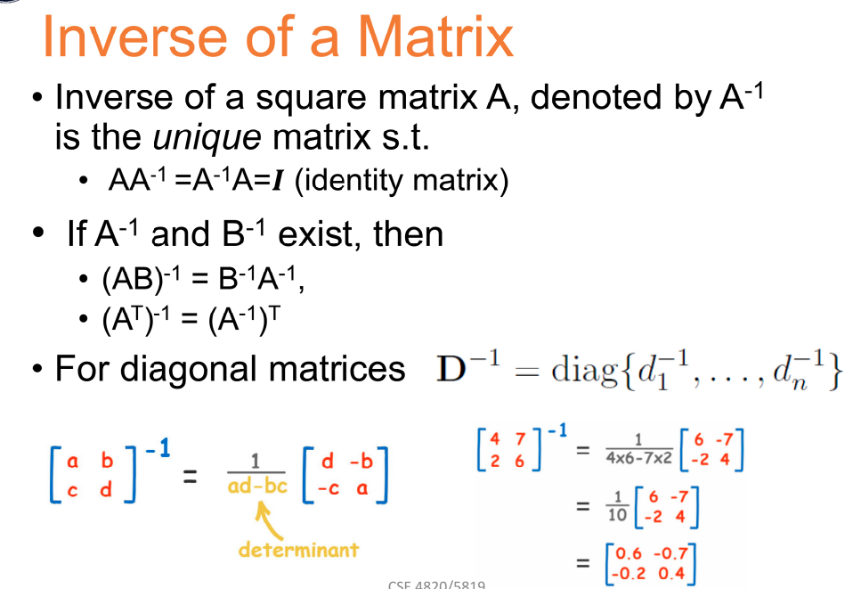
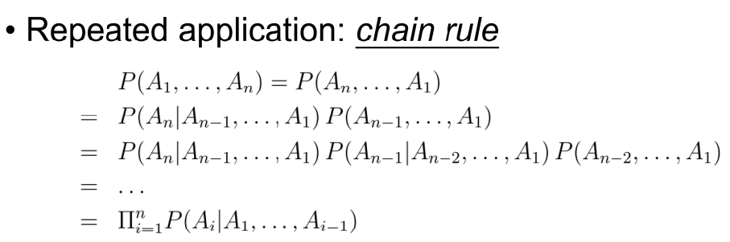

## 概念
- Scalars: a single number (int, float, etc), denote it as "a,n,x"
- Vectors: 1 D array of numbers, denode as $R^n$
- Matrices: 2-D array of numbers, denode as $R^(m*n)$
- Tensors: an array of number, it can be:
    - Zero dimensions: scalar
    - One dimension: vector
    - Two dimensions: matrix
    - or more dimensions

- Special Matrices
    

## 矩阵运算
- Matrix Addition : 按位置相加
- Scalar times vector : 每个元素都*x
- Matrix Transpose : 转置
- Element-by-element product VS. Dot product (*)

- Vector Norm : 
    - L1/L2 Normalization
    - max Normalization : 取最大值
- Matrix Dot product : 矩阵乘法
- Inverse of Matrix: 逆矩阵

## Probability Theory for ML
- Sample Space : a set of possible outcomes of an experiment
- Probability 
- Conditional Probabilities : 条件概率, P(A|B)
- Joint Evnets: P(A,B) 表示AB两件事同时发生
    - P(A|B) = P(A, B) / P(B)
    - P(A, B) = P(A|B) * P(B) = P(B|A) * P(A) : Product Rule
- Chain Rule

## Distributions
- Cumulative distribution function (CDF) 分布函数
- Probability density function： PDF 概率密度函数
- Mean and Variance: 均值和方差
- 高斯/伯努利/uniform分布
- likelihood 似然性
    - MLE: maximum likelihood estimation 最大似然估计

