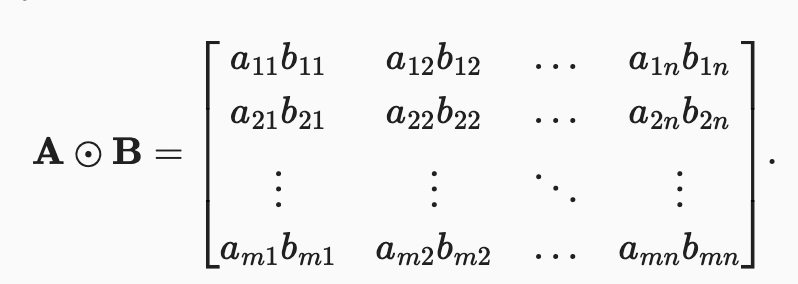
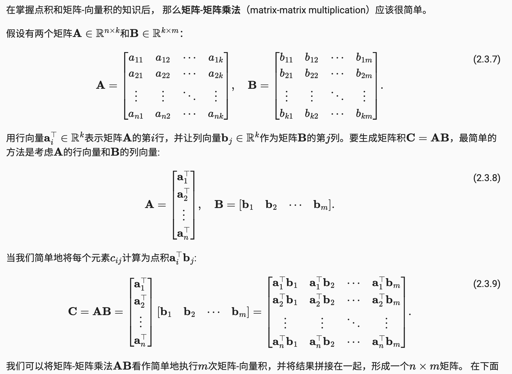
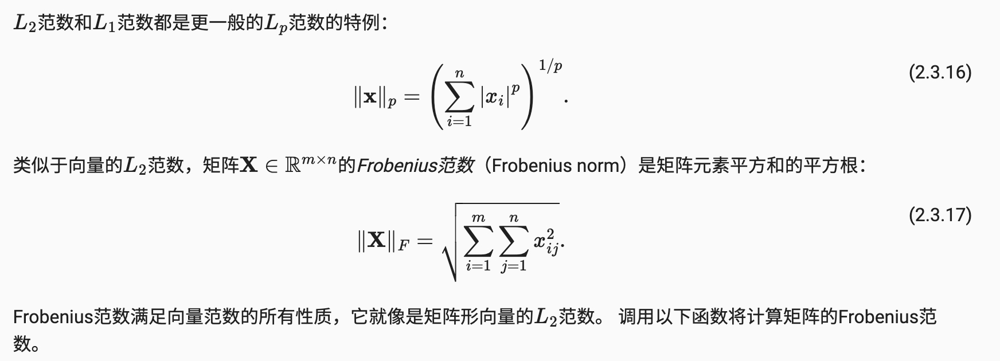
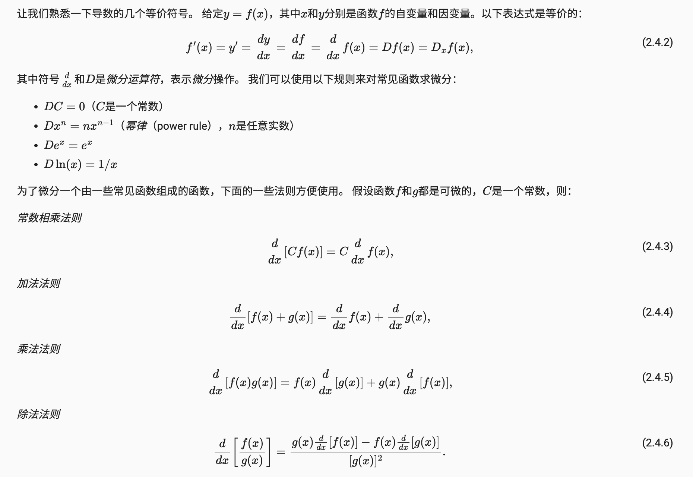
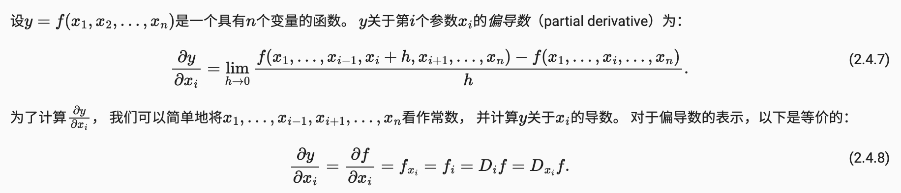
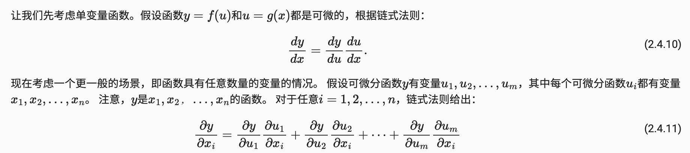

# 项目原地址：https://zh.d2l.ai/

# 预备知识
#### 1, 获取Tensor的形状 和 元素个数
- size(), shape, numel()

```shell
>>> import torch
>>> a = torch.ones(3,4)
>>> a
tensor([[1., 1., 1., 1.],
        [1., 1., 1., 1.],
        [1., 1., 1., 1.]])
>>> a.size()
torch.Size([3, 4])
>>> a.shape
torch.Size([3, 4])
>>> a.numel()
12
```

#### 2, 数据读取 - pandas (与张量兼容)

```python
# 基于pandas 读csv文件
import pandas as pd

data = pd.read_csv(data_file)
```

#### 3, 线性代数基础
- hadamard product (哈达玛积)
    - 两个shape相同的矩阵，按元素乘法
    
- dot product (点积) 也是矩阵 - 向量乘法，矩阵 - 矩阵乘法的基础
    - np.dot()
- 矩阵 - 矩阵乘法
    
- norm 范数
    - 范数用来表示向量的大小(即向量的长度)
    - L1 范数 (向量元素绝对值之和)
    - L2 范数 (向量元素平方和的平方根)
    - Frobenius 范数 - 类似于向量的的L2范数，是矩阵元素平方和的平方根
    

#### 4, 导数与微分
- 用于模型的反向传播和weights迭代
    - 对于每个参数， 如果我们把这个参数增加或减少一个无穷小的量，可以知道损失会以多快的速度增加或减少
- 微分的基础法则
    
    - 备注：
        - Python中基于matplotlib画图
- 偏导数 & 链式法则
    - 多元函数的偏导数
    
    - 链式法则
    
