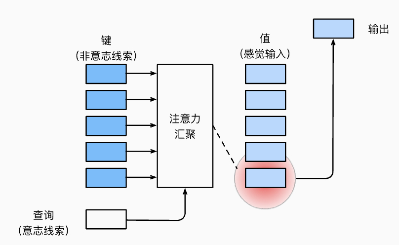
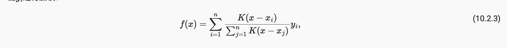
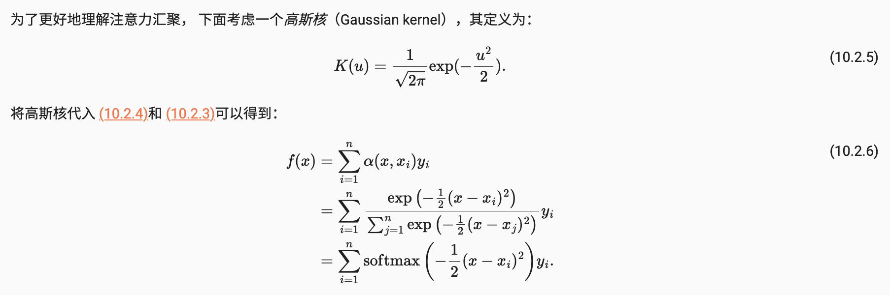
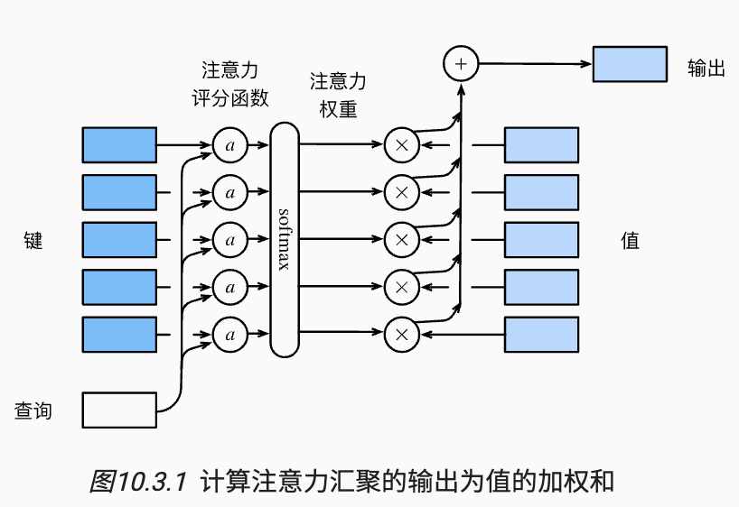
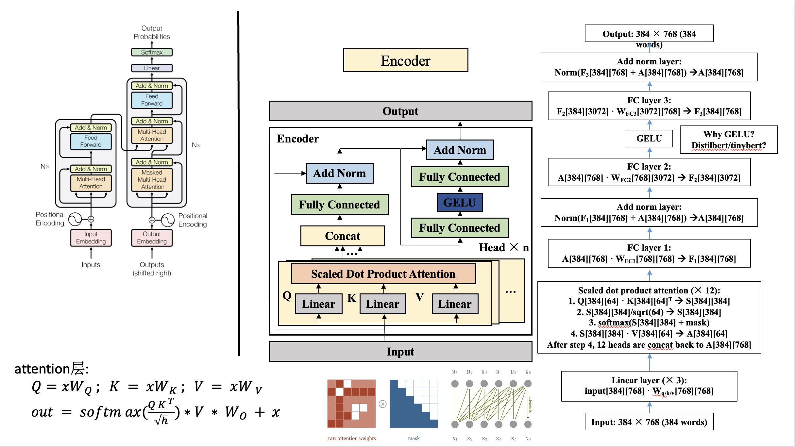

# 解码器 & 编码器 (seq-to-seq)

当输入输出都是不定长度时，我们可以使用编码器-解码器(encoder-decoder)来处理。主要基于2014年的两篇论文：
- Cho et al., [Learning Phrase Representations using RNN Encoder-Decoder for Statistical Machine Translation](https://arxiv.org/abs/1406.1078)
- Sutskever et al., [Sequence to Sequence Learning with Neural Networks](https://arxiv.org/abs/1409.3215)
以上两个工作本质是都是使用了两个循环神经网络，分别叫做编码器和解码器。来处理输入 和 产出输出


# 注意力机制

### 注意力中的Q,K,V来源
- 生物中的注意力机制 可以分为两部分： 
  - 非自主性提示：根据环境中物体自身的突出性和易见性，比如一堆黑色物体中的红色物体，拥有更高的注意力Score。导致该物体被选择
  - 自主性提示：『人』根据『想要做某件事』的自主性输入，此时与这件事情相关的事物得到了更多的注意力，导致相关物品被选择

- 抽象：基于上面的自主性提示，将注意力机制抽象为 "注意力汇聚": 
  - 自主性提示被称为查询（query）。 给定任何查询，注意力机制通过注意力汇聚（attention pooling） 将选择引导至感官输入（sensory inputs，例如中间特征表示）。 在注意力机制中，这些感官输入被称为值（value）。 更通俗的解释，每个值都与一个键（key）配对， 这可以想象为感官输入的非自主提示。 如下图所示，可以通过设计注意力汇聚的方式， 便于给定的查询（自主性提示）与键（非自主性提示）进行匹配， 这将引导得出最匹配的值（感官输入）。



### Note: 快速可复用的展示注意力的可视化

```python
import torch
from d2l import torch as d2l

#@save
def show_heatmaps(matrices, xlabel, ylabel, titles=None, figsize=(2.5, 2.5),
                  cmap='Reds'):
    """显示矩阵热图"""
    d2l.use_svg_display()
    num_rows, num_cols = matrices.shape[0], matrices.shape[1]
    fig, axes = d2l.plt.subplots(num_rows, num_cols, figsize=figsize,
                                 sharex=True, sharey=True, squeeze=False)
    for i, (row_axes, row_matrices) in enumerate(zip(axes, matrices)):
        for j, (ax, matrix) in enumerate(zip(row_axes, row_matrices)):
            pcm = ax.imshow(matrix.detach().numpy(), cmap=cmap)
            if i == num_rows - 1:
                ax.set_xlabel(xlabel)
            if j == 0:
                ax.set_ylabel(ylabel)
            if titles:
                ax.set_title(titles[j])
    fig.colorbar(pcm, ax=axes, shrink=0.6);
```

### 非参数注意力汇聚 & 参数注意力汇聚
- 将注意力汇聚的输出计算变成Value的加权和

- 非参数注意力汇聚 : 纯数学角度的算法，例如：Nadaraya-Watson核回归（Nadaraya-Watson kernel regression）
    - Nadaraya-Watson 核回归，主要思路是根据输入的位置 x 来对输出 $y_i$ 进行加权.
    
    
    - 为了更好的理解，下面考虑一个高斯核(Gaussian kernel), 带入后得到了更常规的一中注意力机制： softmax
    

- 参数注意力汇聚 : 用NN-矩阵 weights 来取代高斯核, 让模型去学习

- 其实这里 x = query = key, value = $y_i$


### 注意力评分机制
- 因为上面将注意力汇聚的输出计算变成Value的加权和，那么需要保证注意力汇聚更准确，引入新的注意力评分函数 - scoring function



- 掩蔽softmax操作 : softmax操作用于输出一个概率分布作为注意力机制权重，但是在某些情况下，并非所有值都应该被纳入到注意力汇聚中：需要mask调这部分结果。
  - 可以参考 self-attention 中的Mask Matrix，起到相同的作用

- 加性注意力 - additive attention
  - 当查询Query 和 Key是不同长度的矢量时，可以分开计算 q 和 k，在累加注意力
    $a(q,k) = w_v^T * tanh(W_q * q + W_k * k) \in R$
  - 这里的 $W_q$,  $W_k$ 和 $W_v$ 参数都是可以学习的；

- <font color=Red> **缩放点积注意力 - (Transformer使用的机制)** </font>
  - 为了得到更高的计算效率，但是点积操作需要 Query 和 Key 具有相同的长度d
  - **可以通过 $W_q$, $W_k$, 和 $W-v$ 来计算得到相同长度d的 Q，K, V**

    $softmax(\frac {QW^T} {\sqrt{d}}) * V \in R^{n*v}$

### 多头注意力
- 当给定相同的查询、键和值的集合时， 我们希望模型可以基于相同的注意力机制学习到不同的行为， 然后将不同的行为作为知识组合起来， 捕获序列内各种范围的依赖关系 （例如，短距离依赖和长距离依赖关系）。 因此，允许注意力机制组合使用查询、键和值的不同 子空间表示（representation subspaces）可能是有益的。
- 多头注意力机制 - concat

### 自注意力 & 位置编码
- 自注意力机制：当 Query, Key 和 Value 来自同一组输入时，attention关注在sequence内部 => 自注意力机制（self-attention）

- 位置编码：循环神经网络是逐个的重复地处理词元，能够获取到词元的位置信息；但是注意力机制使用matrix计算，放起来顺序操作，为了保证序列的顺序信息不丢失 => 位置编码
  - 基于正弦函数和余弦函数
    - 假设输入表示 $X \in R^{n*d}$ 包含一个序列中n个词元的d维嵌入表示。位置编码使用相同形状的位置嵌入矩阵 $P \in R^{n*d}$ 输出 X + P， 矩阵第 $i$ 行，第 $2j$ 和 $2j + 1$ 上的元素为:

        $PE_t = [sin(W_0t), sin(W_1t), ..., sin(W_{i-1}t), ..., sin(W_{d-1}t)]$
    
        $W_i = \frac {1}{10000^{i/d}}$
    - 注意，这里可以使用cos 或者 交替使用sin 和 cos
  
  - 算法实现
    ```python
    #@save
    class PositionalEncoding(nn.Module):
        """位置编码"""
        def __init__(self, num_hiddens, dropout, max_len=1000):
            super(PositionalEncoding, self).__init__()
            self.dropout = nn.Dropout(dropout)
            # 创建一个足够长的P
            self.P = torch.zeros((1, max_len, num_hiddens))
            X = torch.arange(max_len, dtype=torch.float32).reshape(
                -1, 1) / torch.pow(10000, torch.arange(
                0, num_hiddens, 2, dtype=torch.float32) / num_hiddens)
            self.P[:, :, 0::2] = torch.sin(X)
            self.P[:, :, 1::2] = torch.cos(X)

        def forward(self, X):
            X = X + self.P[:, :X.shape[1], :].to(X.device)
            return self.dropout(X)
    ```
  - 为什么使用正弦函数？
    - 最直观的想法：通过整型值来标记位置：0，1，2； 但是a),模型可能会遇到比训练时所用的更长的序列，不利于模型泛化; b),模型的位置表示是无边界的，长度越长，位置值越大
    - 使用【0，1】范围来表示，有多少个token就将区间划分成几份。但是这样：sequence长度不一致时，token之间的相对间距也是不一样的
    - 用二进制向量标记位置: 因为位置信息需要作用在input embedding上，因此比起单一的值，更好的方案是使用一个和input embedding维度一样的向量来表示位置 => 如何获取一个有边界的向量标识
    - 使用正余弦函数：结果在 $[-1，1]$ 之间; 且在 $PE_t$ 中,越靠近左侧的变化速度越慢，符合二进制的特点


# Transformer
- Model架构
  - 基于位置的前馈网络
  - 残差连接和 Layer Norm
    

  - 当输入token被记作X, 那么QKV分别通过以下方式计算得到
  Q = W_Q * X: 表示查询向量
  K = W_K * X: 表示被查询信息V 与 所有其他信息之间的相关性，也是向量表示的
  V = W_V * X: 表示被查询信息的向量

- 编码器
```python
#@save
class EncoderBlock(nn.Module):
    """Transformer编码器块"""
    def __init__(self, key_size, query_size, value_size, num_hiddens,
                 norm_shape, ffn_num_input, ffn_num_hiddens, num_heads,
                 dropout, use_bias=False, **kwargs):
        super(EncoderBlock, self).__init__(**kwargs)
        self.attention = d2l.MultiHeadAttention(
            key_size, query_size, value_size, num_hiddens, num_heads, dropout,
            use_bias)
        self.addnorm1 = AddNorm(norm_shape, dropout)
        self.ffn = PositionWiseFFN(
            ffn_num_input, ffn_num_hiddens, num_hiddens)
        self.addnorm2 = AddNorm(norm_shape, dropout)

    def forward(self, X, valid_lens):
        Y = self.addnorm1(X, self.attention(X, X, X, valid_lens))
        return self.addnorm2(Y, self.ffn(Y))

#@save
class TransformerEncoder(d2l.Encoder):
    """Transformer编码器"""
    def __init__(self, vocab_size, key_size, query_size, value_size,
                 num_hiddens, norm_shape, ffn_num_input, ffn_num_hiddens,
                 num_heads, num_layers, dropout, use_bias=False, **kwargs):
        super(TransformerEncoder, self).__init__(**kwargs)
        self.num_hiddens = num_hiddens
        self.embedding = nn.Embedding(vocab_size, num_hiddens)
        self.pos_encoding = d2l.PositionalEncoding(num_hiddens, dropout)
        self.blks = nn.Sequential()
        for i in range(num_layers):
            self.blks.add_module("block"+str(i),
                EncoderBlock(key_size, query_size, value_size, num_hiddens,
                             norm_shape, ffn_num_input, ffn_num_hiddens,
                             num_heads, dropout, use_bias))

    def forward(self, X, valid_lens, *args):
        # 因为位置编码值在-1和1之间，
        # 因此嵌入值乘以嵌入维度的平方根进行缩放，
        # 然后再与位置编码相加。
        X = self.pos_encoding(self.embedding(X) * math.sqrt(self.num_hiddens))
        self.attention_weights = [None] * len(self.blks)
        for i, blk in enumerate(self.blks):
            X = blk(X, valid_lens)
            self.attention_weights[
                i] = blk.attention.attention.attention_weights
        return X
```
- 解码器
```python
class DecoderBlock(nn.Module):
    """解码器中第i个块"""
    def __init__(self, key_size, query_size, value_size, num_hiddens,
                 norm_shape, ffn_num_input, ffn_num_hiddens, num_heads,
                 dropout, i, **kwargs):
        super(DecoderBlock, self).__init__(**kwargs)
        self.i = i
        self.attention1 = d2l.MultiHeadAttention(
            key_size, query_size, value_size, num_hiddens, num_heads, dropout)
        self.addnorm1 = AddNorm(norm_shape, dropout)
        self.attention2 = d2l.MultiHeadAttention(
            key_size, query_size, value_size, num_hiddens, num_heads, dropout)
        self.addnorm2 = AddNorm(norm_shape, dropout)
        self.ffn = PositionWiseFFN(ffn_num_input, ffn_num_hiddens,
                                   num_hiddens)
        self.addnorm3 = AddNorm(norm_shape, dropout)

    def forward(self, X, state):
        enc_outputs, enc_valid_lens = state[0], state[1]
        # 训练阶段，输出序列的所有词元都在同一时间处理，
        # 因此state[2][self.i]初始化为None。
        # 预测阶段，输出序列是通过词元一个接着一个解码的，
        # 因此state[2][self.i]包含着直到当前时间步第i个块解码的输出表示
        if state[2][self.i] is None:
            key_values = X
        else:
            key_values = torch.cat((state[2][self.i], X), axis=1)
        state[2][self.i] = key_values
        if self.training:
            batch_size, num_steps, _ = X.shape
            # dec_valid_lens的开头:(batch_size,num_steps),
            # 其中每一行是[1,2,...,num_steps]
            dec_valid_lens = torch.arange(
                1, num_steps + 1, device=X.device).repeat(batch_size, 1)
        else:
            dec_valid_lens = None

        # 自注意力
        X2 = self.attention1(X, key_values, key_values, dec_valid_lens)
        Y = self.addnorm1(X, X2)
        # 编码器－解码器注意力。
        # enc_outputs的开头:(batch_size,num_steps,num_hiddens)
        Y2 = self.attention2(Y, enc_outputs, enc_outputs, enc_valid_lens)
        Z = self.addnorm2(Y, Y2)
        return self.addnorm3(Z, self.ffn(Z)), state


class TransformerDecoder(d2l.AttentionDecoder):
    def __init__(self, vocab_size, key_size, query_size, value_size,
                 num_hiddens, norm_shape, ffn_num_input, ffn_num_hiddens,
                 num_heads, num_layers, dropout, **kwargs):
        super(TransformerDecoder, self).__init__(**kwargs)
        self.num_hiddens = num_hiddens
        self.num_layers = num_layers
        self.embedding = nn.Embedding(vocab_size, num_hiddens)
        self.pos_encoding = d2l.PositionalEncoding(num_hiddens, dropout)
        self.blks = nn.Sequential()
        for i in range(num_layers):
            self.blks.add_module("block"+str(i),
                DecoderBlock(key_size, query_size, value_size, num_hiddens,
                             norm_shape, ffn_num_input, ffn_num_hiddens,
                             num_heads, dropout, i))
        self.dense = nn.Linear(num_hiddens, vocab_size)

    def init_state(self, enc_outputs, enc_valid_lens, *args):
        return [enc_outputs, enc_valid_lens, [None] * self.num_layers]

    def forward(self, X, state):
        X = self.pos_encoding(self.embedding(X) * math.sqrt(self.num_hiddens))
        self._attention_weights = [[None] * len(self.blks) for _ in range (2)]
        for i, blk in enumerate(self.blks):
            X, state = blk(X, state)
            # 解码器自注意力权重
            self._attention_weights[0][
                i] = blk.attention1.attention.attention_weights
            # “编码器－解码器”自注意力权重
            self._attention_weights[1][
                i] = blk.attention2.attention.attention_weights
        return self.dense(X), state

    @property
    def attention_weights(self):
        return self._attention_weights
```
