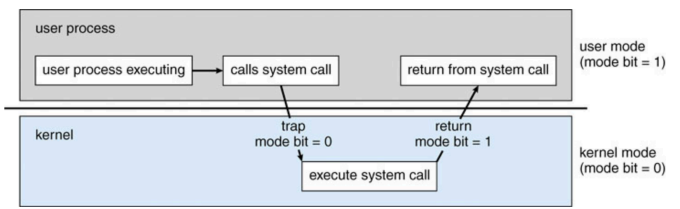

# Intro of OS

- What is OS
  - OS controls/mediates/manages access to hardware resources
    - CPUs, Memory, Disk, Network, input/output devices
  - OS defines a set of logical resources(objects) and a set of well-defined operations on these objects(interfaces)
  简写=>
  - Resource manager
  - Extended(abstract) machine  

# Hardware-OS-Applications

- Typical OS Structure
  - Application             : 程序员编写并编译好的程序，通过调用Libraries 提供的函数来使用OS
  - Libraries               : 公共的库，提供预编译好的interface，供程序员使用
  - Portable OS Layer       : OS system calls
  - Machine-dependent Layer : Bootstrap, System initialization, I/O device driver, Kernel/User mode switching, Interrupt and exception, Provessor Management
 
  

- Dual-Mode Operation
  - User mode
    - limited privileges
    - can only run non-privileged instructions
  - Kernel mode:
    - full privileges of the hardware
    - can run all instructions
  - Every CPU (a CPU core actively) can run in one of the two modes.
    - "mode" is indicated by a status bit in a protected CPU control register
      - x86: the Current Privilege Level(CPL) in the register
      - MIPS: the status reister
  - 与之对应的，对Instructions分组，Privileged Instructions仅能在kernel level下执行(for security/fairness)
  - User level run in user mode
  - Kernel level run in kernel mode

- Privileged Instructions
  - the CPU checks mode bit when privileged instructions execute
  - directly access I/O devices(disks, printers, ...) 
  - manipulate memory management state
    - TLB management, page table pointers
  - halt instruction
  - manipulate protected control register
    - mode bit, interrupt level

# System Calls
- Interface between a process and the operating system kernel
  - Kernel manages sharedresources & exports interface
  - Process requests for access to shared resources
- privileged
- Categories:
  - Process management
  - Memory management
  - File management
  - Device management
  - Networking
- Given the I/O instructions examples
  - open()
  - read()
  - write()

### Transit from user to kernel
- use system call
  - context switch: restore regs, save regs
  

- by interrupt
  - Poll: A device continuously checks the status of another device to see if it needs attention.
  - Interrupt: A device signals the CPU to immediately handle a specific task. 
  - Polling involves continually checking the status of a device, while interrupts allow devices to signal when an event needs immediate attention
  - Types:
    - Hardware interrupt: time expires, I/O device events like keyboard strokes.
    - Software interrupt: errors, system calls
  - 中断发生时，save the current state of CPU on the system stack; Restore the state before returning.

### Modern OS is an giant interrupt handler

### Questions about interrupt:
- Can the interrupt handler itself be interrupted? (Consider why there might be different IRQ levels?)
  - Yes, an interrupt handler can be interrupted by another interrupt if that interrupt has a higher priority. In many systems, there are different Interrupt Request (IRQ) levels, which define priority levels for various interrupts.
- Can we and shall we disable interrupts?
  - Yes, 
- What is an alternative approach to using interrupts?
  - polling
- What are the drawbacks of that approach?
  - polling increased CPU usage, continues checking the states of devices
  - high latency: the time it takes to respond to an event depends on the frequency of polling. If polling occurs at long intervals, devices may experience higher latency in having their requests serviced.
  - keep checking waste CPU resource