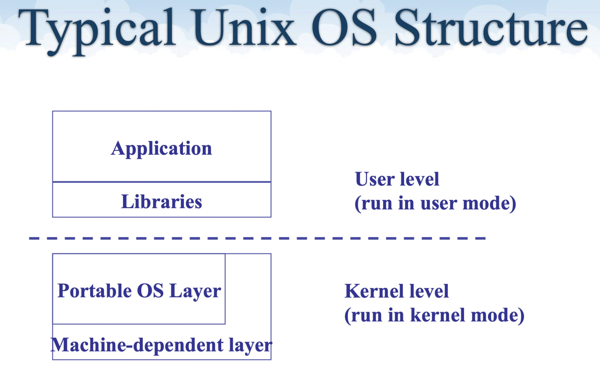

# Intro

- What is OS
  - OS controls/mediates/manages access to hardware resources
    - CPUs, Memory, Disk, Network, input/output devices
  - OS defines a set of logical resources(objects) and a set of well-defined operations on these objects(interfaces)

- Typical OS Structure
  - Application             : 程序员编写并编译好的程序，通过调用Libraries 提供的函数来使用OS
  - Libraries               : 公共的库，提供预编译好的interface，供程序员使用
  - Portable OS Layer       : OS system calls
  - Machine-dependent Layer : Bootstrap, System initialization, I/O device driver, Kernel/User mode switching, Interrupt and exception, Provessor Management
 
  

- Dual-Mode Operation
  - User mode
    - limited privileges
    - can only run non-privileged instructions
  - Kernel mode:
    - full privileges of the hardware
    - can run all instructions
  - Every CPU (a CPU core actively) can run in one of the two modes.
    - "mode" is indicated by a status bit in a protected CPU control register
      - x86: the Current Privilege Level(CPL) in the register
      - MIPS: the status reister
  - 与之对应的，对Instructions分组，Privileged Instructions仅能在kernel level下执行(for security/fairness)，like directly access I/O devices, halt instruction, ...

