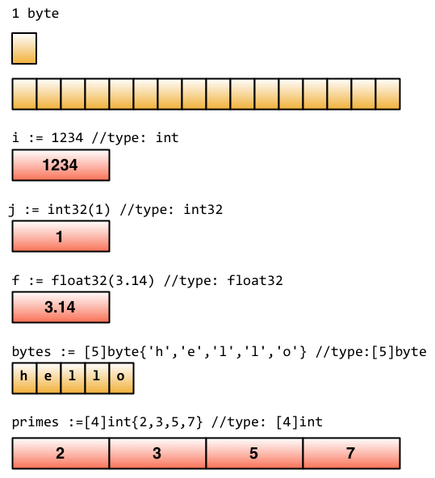

## 变量 & 常量
### 定义变量

```Go
// 类型相同
var vname1, vname2, vname3 type = v1, v2, v3

// 简化
var vname1, vname2, vname3 = v1, v2, v3

vname1, vname2, vname3 := v1, v2, v3
```
- 注意: **":="** 这个符号直接取代了 var 和 type, 这种形式叫做简短声明。不过它有一个限制，那就是它只能用在函数内部；在函数外部使用则会无法编译通过，所以一般用 var 方式来定义全局变量。


### 常量
- const关键字

```Go
const Pi = 3.1415926
const Pi float32 = 3.1415926    // 可以指定常量类型
const i = 10000
const MaxThread = 10
const prefix = "astaxie_"
```

## 内置基础类型
- bool
- int 和 uint
    - int 和 uint 的长度取决于不同编译器的实现
    - 支持固定位数的类型: 
        - int8, int16, int32, int64, rune
        - uint8, uint16, uint32, uint64, byte
        - rune 是 int32 的别称
        - byte 是 uint8 的别称
        - 注意这些不同类型的变量变量质检不允许相互赋值或操作，会编译器报错
- float32 和 float64
    - 没有float类型, 默认是float64
    - Go也支持复数：默认 *complex128* (64位实数 + 64位虚数)，也支持 *complex64* (32位实数 + 32位虚数)
- string - 字符串
    - 一般用 "" 括起来；如果需要声明多行，可以用 *\`* 来声明 (\'括起的字符串为 Raw 字符串，即字符串在代码中的形式就是打印时的形式，它没有字符转义，换行也将原样输出)。
    - Go 中字符串是不可变的，如果想要修改; 
        - 可以将字符串转换成 []byte 类型，修改之后，再转回 string 类型
        - 也可以通过切片来修改： 字符串可以进行切片操作
        - 可以通过 + 来链接两个字符串
- error - 错误类型
    - errors 包可以声明和处理错误
- Go 数据底层的存储
    

```Go
// Boolean
var isActive bool  // 全局变量声明
var enabled, disabled = true, false  // 忽略类型的声明
func test() {
    var available bool  // 一般声明
    valid := false      // 简短声明
    available = true    // 赋值操作
}

// Int
// 下面代码就会产生 invalid operation: a+b (mismatched types int8 and int32)
// 注意 int 和 int32 也不能互用
var a int8
var b int32
c := a + b

// 复数
var c complex64 = 5+5i

// string
var m string = `hello
    world`
var s string = "hello"
s[0] = 'c'   // cannot assign to s [0]
// 借助 []byte
c := []byte(s)
c[0] = 'c'
s2 = string(c)  // s2 = cello
// 通过切片
s = "c" + s[1:]  // s = cello

s := "hello, "
m := "world"
a := s + m       // a = "hello, world"

// error
err := errors.New("emit macho dwarf: elf header corrupted")
if err != nil {
    fmt.Print(err)
}
```

### iota 枚举
- Go里面的关键字：iota，用来声明 enum 的时候采用，它默认的开始值是0， const中每增加1行，值+1

```Go
const (
    x = iota // x == 0
    y = iota // y == 1
    z = iota // z == 2
    w        // 常量声明省略值时，默认和之前一个值的字面相同。这里隐式地说 w = iota，因此 w == 3。其实上面 y 和 z 可同样不用 "= iota"
)

const v = iota // 每遇到一个 const 关键字，iota 就会重置，此时 v == 0

const (
    h, i, j = iota, iota, iota // h=0,i=0,j=0 iota在同一行值相同
)

const (
    a       = iota // a=0
    b       = "B"
    c       = iota             //c=2
    d, e, f = iota, iota, iota //d=3,e=3,f=3
    g       = iota             //g = 4
)
```

### 首字母 大写 vs 小写
- 变量 & 函数: 首字母大写表示公有，可以被其他包读取，小写表示私有，表示不可导出


## array, slice, map
- array - 数组
    - 数组是定长的，长度定义之后不能修改
    - 支持多维数组
- slice
    - slice 并不是真正意义上的动态数组，而是一个 <font color=#FF000>**引用类型**</font>。slice 总是指向一个底层 array，slice 的声明也可以像 array 一样，只是不需要长度。
    
- map - 字典
    - map[keyType]valueType
    - map 是无序的，每次打印出来的 map 都会不一样，它不能通过 index 获取，而必须通过 key 获取
    - map 的长度是不固定的，也就是和 slice 一样，也是一种引用类型
    - 内置的 len 函数同样适用于 map，返回 map 拥有的 key 的数量
    - map 的值可以很方便的修改，通过 numbers["one"]=11 可以很容易的把 key 为 one 的字典值改为 11
    - 在 Go 中，没有值可以安全地进行并发读写，它不是 thread-safe，在多个 go-routine 存取时，必须使用 mutex lock 机制


```Go
// Golang 并没有提供 Linked Lists 的数据结构
// 全局：
var arr0 [5]int = [5]int{1, 2, 3}
var arr1 = [5]int{1, 2, 3, 4, 5}
var arr2 = [...]int{1, 2, 3, 4, 5, 6}   // 根据初始化值确定数组长度
var str = [5]string{3: "hello world", 4: "tom"}
// 局部：
a := [3]int{1, 2}           // 未初始化元素值为 0。
b := [...]int{1, 2, 3, 4}   // 通过初始化值确定数组长度。
c := [5]int{2: 100, 4: 200} // 使用索引号初始化元素。
d := [...]struct {
    name string
    age  uint8
}{
    {"user1", 10}, // 可省略元素类型。
    {"user2", 20}, // 别忘了最后一行的逗号。
}
// Note: 数组是定长的, 长度定义之后不能再修改


// Slice 是数组的一个封装，通过内部指针和相关属性引用数组片段. (数组的引用), 也支持通过下标访问引用的数组元素. 
// Slice 是引用类型，但是本身是结构体，还是值传递。
// Slice实际上是一个结构体：底层的存储类型是数组
// runtime/slice.go
type slice struct {
    array unsafe.Pointer // 元素指针
    len   int // 长度 
    cap   int // 容量
}
// Node: 底层数组是可以被多个 slice 同时指向的，因此对一个 slice 的元素进行操作是有可能影响到其他 slice 的。
slice := []int{0, 1, 2, 3, 4, 5, 6, 7, 8, 9}
s1 := slice[2:5]
s2 := s1[2:6:7]

s2 = append(s2, 100)
s2 = append(s2, 200)

s1[2] = 20


// map
// 声明一个 key 是字符串，值为 int 的字典, 这种方式的声明需要在使用之前使用 make 初始化
var numbers map[string]int
// 另一种 map 的声明方式
numbers := make(map[string]int)
numbers["one"] = 1  // 赋值
numbers["ten"] = 10 // 赋值
numbers["three"] = 3

fmt.Println("第三个数字是: ", numbers["three"]) // 读取数据
// 打印出来如:第三个数字是: 3
```


### make 和 new 操作
- make 用于内建类型（map、slice 和 channel）的内存分配
    - 返回初始化后的（非零）值
- new 用于各种类型的内存分配, 
    - 返回值是对应内存地址的指针


### 零值 - 变量未填充前的默认值

```Go
int     0
int8    0
int32   0
int64   0
uint    0x0
rune    0 // rune 的实际类型是 int32
byte    0x0 // byte 的实际类型是 uint8
float32 0 // 长度为 4 byte
float64 0 // 长度为 8 byte
bool    false
string  ""
```

## 流程控制
- if
    - Golang 中的if判断不需要"()"
    - 允许在条件判断语句中声明变量 - 这个变量的作用域只在该条件判断逻辑块内
    - 多个条件可以使用 "else if" 
- goto
    - goto 语句 —— 请明智地使用它。用 goto 跳转到必须在当前函数内定义的标签。
- for
    - Golang中没有while，但是for支持while的功能(";"都可以省略)：for sum < 1000 { ... }
    - 其他的跟C++一致，不需要 "()"
    - "break" 和 "continue" 都是支持的
    - "for" 配合 "range" 可以用于读取 slice 和 map 的数据
- switch
    - Golang中，switch相当于每个 case 后面都带有break (不像C++ 需要手动加上break, 默认会按顺序继续执行下一个case分支)
    - 可以通过fallthrough来强制执行后面的case，跟C++打平效果
```Go
import (
    "fmt"
)

// if
// 计算获取值x，然后根据x返回的大小，判断是否>10
if x := computedValue(); x>10 {
    fmt.Println("...")
}

// goto - 实现了一个循环
func myFunc() {
    i := 0
Here:   // 这行的第一个词，以冒号结束作为标签
    println(i)
    i++
    goto Here   // 跳转到 Here 去
}

// for
sum := 0;
// 标准格式
for index:=0; index < 10 ; index++ {
    sum += index
}
// expression1 和 expression3 可以忽略
for ; sum < 100; {
    sum += sum
}
// 全部忽略 - 类似 while 的功能
for sum < 1000 {
    sum += sum
}
// range
for key, value := range map {
    fmt.Println("map's key:",k)
    fmt.Println("map's val:",v)
}

// switch
// 默认会带上 break
i := 10
switch i {
case 1:
    fmt.Println("i is equal to 1")
case 2, 3, 4:
    fmt.Println("i is equal to 2, 3 or 4")
case 10:
    fmt.Println("i is equal to 10")
default:
    fmt.Println("All I know is that i is an integer")
}
// fallthrough强制执行后面的case代码
integer := 6
switch integer {
case 5:
    fmt.Println("The integer was <= 5")
    fallthrough
case 6:
    fmt.Println("The integer was <= 6")
    fallthrough
case 7:
    fmt.Println("The integer was <= 7")
    fallthrough
default:
    fmt.Println("default case")
}
// 结果：
// The integer was <= 6
// The integer was <= 7
// default case 
```

## 函数
- Go 函数可以返回多个值
- Go 支持命令返回参数的变量，这样函数内不需要初始化变量 + 返回的时候也可以不带上变量名
- 支持变参: 有着不定数量的参数
- <font color=red>**Go只支持 "值传递"**</font>
    - Golang的函数传递只支持值传递，传递的都是变量的copy
    - 传递指针参数 "x *int" 时，也是传递的指针参数值的copy
- <font color=blue>因为 Golang 有值类型 和 引用类型 的区分，导致某些传递看起来像是引用传递</font>
    - 值类型: 变量直接存储值，内存通常在栈上分配，在函数调用完被释放。
        - int
        - float
        - bool
        - string
        - array
        - struct
    - 引用类型: 变了存储的是一个地址，这个地址上才存储的最终的value，内存通常在堆上分配，通过GC回收
        - slice
        - map
        - channel
        - interface
        - func
- defer语句
    - 你可以在函数中添加多个 defer 语句。当函数执行到最后时，这些 defer 语句会按照逆序执行，最后该函数返回。
    - 一般是当你在进行一些打开资源的操作时，为了保证在遇到错误需要提前返回时关闭相应的资源，避免资源泄露问题。会在资源打开的位置加上对应的defer语句
- <>Go中函数 作为 变量
    - 通过 type 来定义函数变量的类型
- "panic" 和 "recover"
    - panic 是一个内建函数，可以中断原有的函数控制流程(但是函数中的defer可以正常执行)，并中断该goroutine中所有调用的函数.
    - recover仅在延迟函数中有效, 捕获panic, 并恢复正常执行
- init 和 main 函数
    - go程序会自动调用
    - main函数只能应用在 package main中
    - init函数可以在任意 package 中；强烈建议 一个package的一个文件中只写一个init函数


```Go
// 直接定义返回参数的变量 - 函数中不需要定义和初始化了
func SumAndProduct(A, B int) (add int, Multiplied int) {
    add = A+B
    Multiplied = A*B
    return
}

// 变参
func myfunc(args ...int) {
    for _, n := range args {
        fmt.Printf("And the number is: %d\n", n)
    }
}

// 传递值 vs 传递指针
func add_value(a int) {
    a = a+1
}

func add_pointer(a *int) {
    *a = *a+1
}
x:=3
add_value(x)       // x 依旧 = 3
add_pointer(&x)    // x = 4

// defer语句
func ReadWrite() bool {
    file.Open("file")
    defer file.Close()      // defer
    if failureX {
        return false
    }
    if failureY {
        return false
    }
    return true
}

// 函数作为值，类型
type testInt func(int) bool  // 声明了一个函数类型

func isOdd(integer int) bool {
    if integer % 2 == 0 {
        return false
    }
    return true
}
func isEven(integer int) bool {
    if integer%2 == 0 {
        return true
    }
    return false
}
// 下面将声明的函数类型作为参数传递给另一个函数
func filter(slice []int, f testInt) (result []int) {
    for _, value := range slice {
        if f(value) {
            result = append(result, value)
        }
    }
}

```

## struct 结构体

