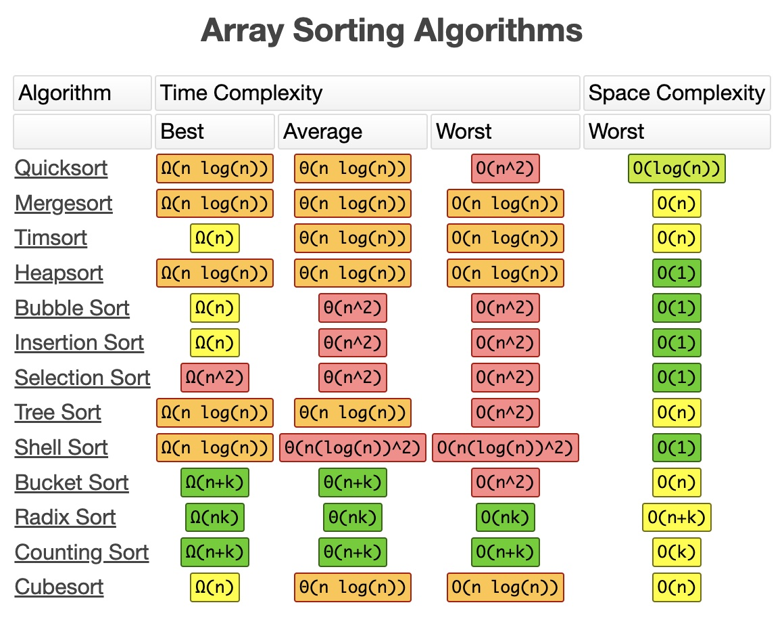

## 分类 + 复杂度分析

- 常用

|Algorithm|Best Time Complexity|Avg TC|Worst TC|Space Complexity|
|--|--|--|--|--|
|Bubble Sort 冒泡|O(n)|O(n^2)|O(n^2)|O(1)|
|Quick Sort|O(nlogn)|O(nlogn)|O(n^2)|O(logn)|
|Insertion Sort|O(n)|O(n^2)|O(n^2)|O(1)|
|Heap Sort|O(nlogn)|O(nlogn)|O(nlogn)|O(1)|

- Others



## 说明 + 实现
- Bubble Sort
    - 通过反复交换相邻的逆序元素，将最大值逐步“冒泡”到数组末尾。
    - Best: 数组已排序 O(n)
    - Worst: 数组逆序 O(n^2)

```go
func bubbleSort(nums []int) []int {
    var len_ = len(nums)

    // each iteration, move the biggest val to "correct" pos
    // => (len_ - i - 1, len_ - 1] already sorted 
    for i := 0; i < len_ - 1; i++ {
        var swapped bool = false
        // from [0, len_ - i - 1], move the biggest val to last
        for j := 0; j < len_ - i - 1; j++ {
            if nums[j] > nums[j+1] {
                nums[j], nums[j+1] = nums[j+1], nums[j]
                swapped = true
            }
        }
        
        // no swap, means already sorted
        if !swapped {
            break
        }
    }

    return nums
}
```

- Quick Sort
    - (二分法)选择一个基准点（通常是数组的一部分），通过分区操作将数组分成小于和大于基准点的两部分，递归排序。
    - Best: O(nlogn)
    - Worst: O(n^2)
    - Space Complexity: 递归栈深度
        - Avg: O(logn)
        - Worst: O(n)

```go
func quickSort(nums []int, left, right int) {
	if left >= right {
		return
	}

	// select benchmark - random
	pivot := left + rand.IntN(right-left+1)
	nums[pivot], nums[left] = nums[left], nums[pivot]
	// iteration: exchange nums[i],nums[j]
	// when nums[i] > nums[left] and nums[j] < nums[left]
	i, j := left, right
	for i < j {
		// last value < nums[left]
		for i < j && nums[j] >= nums[left] {
			j--
		}
		// first value > nums[left]
		for i < j && nums[i] <= nums[left] {
			i++
		}
		if i < j {
			nums[i], nums[j] = nums[j], nums[i]
		}
	}

	// exchange left with j (the last val < nums[left] after the loop)
	nums[j], nums[left] = nums[left], nums[j]

	quickSort(nums, left, j-1)
	quickSort(nums, j+1, right)
}
```

- Insertion Sort
    - 逐步将每个元素插入到已排序部分的正确位置
    - Worst: O(n^2)
    - Best: O(n)

```go
func insertionSort(nums []int) {
	// from left to right, make every item in correct place in range [0: i]
	numsLen := len(nums)
	for i := 0; i < numsLen; i++ {
		pivot := nums[i]
		j := i - 1

		for j >= 0 && nums[j] > pivot {
			// 右移
			nums[j+1] = nums[j]
			j -= 1
		}

		nums[j+1] = pivot
	}
}
```

- Heap Sort
    - 利用堆数据结构进行排序，首先构造最大堆，然后逐步取出堆顶元素（最大值）并调整堆
    - Best/Worst: O(nlogn)

```go
// heap function
func heapify(nums []int, len int, i int) {
	/* move the biggest val to root (level-order): nums[left]
	 * params: nums array
	 * 		   len the length of nums or sub-nums
	 * 		   i: the index of val (node-val)
	 */
	// initial largest as root： suppose the current i is the biggest one
	largest := i
	left := 2*i + 1  // left child index
	right := 2*i + 2 // right child index

	if left < len && nums[left] > nums[largest] {
		largest = left
	}
	if right < len && nums[right] > nums[largest] {
		largest = right
	}
	if largest != i {
		// swap largest val to root: i
		nums[i], nums[largest] = nums[largest], nums[i]
		// for the sub-tree with "largest" as root, since the val in "largest" is changed,
		// we need re-balance the heap
		heapify(nums, len, largest)
	}
}

func heapSort(nums []int) {
	// use max-heap: the left-/right-node is smaller than the root
	// additional:  min-heap: the root keeps the smallest val

	// step1, treat the nums array as a complete binary tree (level-order)
	// pivot = len(nums)/2; 0 ~ pivot-1 is the left sub-tree
	// while the pivot+1 ~ len(nums) is the right sub-tree

	// step2, build a max-heap, keep the biggest val at the root (nums[0])
	numsLen := len(nums)
	// since the heap is thought as level order, we only need consider all "root" node
	for i := numsLen/2 - 1; i >= 0; i-- {
		heapify(nums, numsLen, i)
	}

	// Step3, sort the array by placing largest element at end of unsorted array
	var last_target_idx = numsLen - 1
	for last_target_idx >= 0 {
		// biggest val is at nums[0] for max-heap - swap
		nums[0], nums[last_target_idx] = nums[last_target_idx], nums[0]
		// rebalance the heap
		heapify(nums, last_target_idx, 0)
		last_target_idx -= 1
	}
}
```