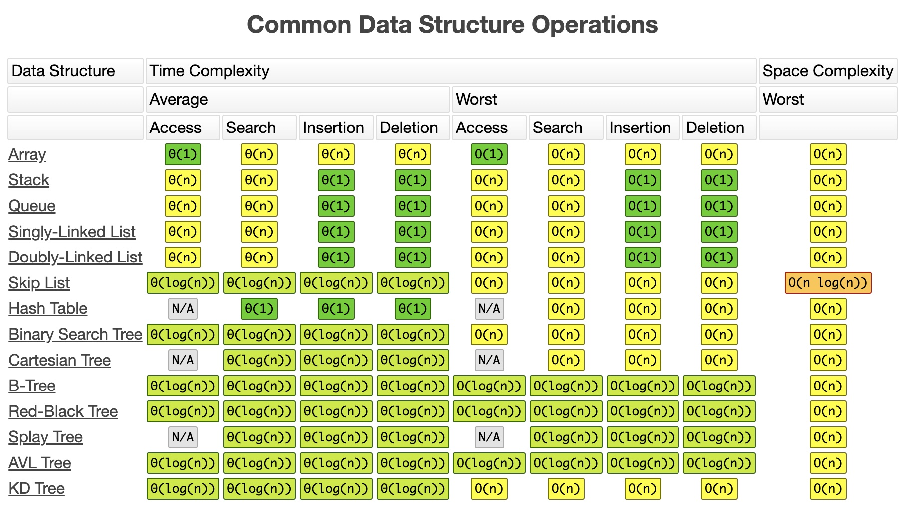

## 数据结构
- ### 数组（Arrays）和 链表 (Linked Lists)
    - [x] 不同语言下的封装：
      - 数组： 对于随机访问的速度很快，但是对于插入（尤其是从头部插入元素）速度很慢，在尾部插入很快。 —— 涉及数据copy
      - 链表： 对于随机访问速度慢的多，对于插入会快很多
        - 单向链表
        - 双向链表

    ```C++
    // C++; C++ 标准库头文件
    #include <iostream>
    #include <vector>
    using namespace std;
    // array 指定长度，如果不确定长度，使用 n[] = {1,2,3,4,5}
    // 固定长度
    int n[5] = {1,2,3,4,5};

    // vector 是对数组的封装, 使用连续内存存储
    vector<int> n = {1,2,3,4,5};

    // list 是对链表的封装, 使用非连续存储，不支持[]下标访问
    list<int> n = {1,2,3,4,5};
    ```

    ```Golang
    // Golang 并没有提供 Linked Lists 的数据结构
    // 全局：
    var arr0 [5]int = [5]int{1, 2, 3}
    var arr1 = [5]int{1, 2, 3, 4, 5}
    var arr2 = [...]int{1, 2, 3, 4, 5, 6}
    var str = [5]string{3: "hello world", 4: "tom"}
    // 局部：
    a := [3]int{1, 2}           // 未初始化元素值为 0。
    b := [...]int{1, 2, 3, 4}   // 通过初始化值确定数组长度。
    c := [5]int{2: 100, 4: 200} // 使用索引号初始化元素。
    d := [...]struct {
        name string
        age  uint8
    }{
        {"user1", 10}, // 可省略元素类型。
        {"user2", 20}, // 别忘了最后一行的逗号。
    }
    // Note: 数组是定长的, 长度定义之后不能再修改
    
    
    // Slice 是数组的一个封装，通过内部指针和相关属性引用数组片段. (数组的引用), 也支持通过下标访问引用的数组元素. 
    // Slice 是引用类型，但是本身是结构体，还是值传递。
    // Slice实际上是一个结构体：底层的存储类型是数组
    // runtime/slice.go
    type slice struct {
        array unsafe.Pointer // 元素指针
        len   int // 长度 
        cap   int // 容量
    }
    // Node: 底层数组是可以被多个 slice 同时指向的，因此对一个 slice 的元素进行操作是有可能影响到其他 slice 的。
    slice := []int{0, 1, 2, 3, 4, 5, 6, 7, 8, 9}
    s1 := slice[2:5]
    s2 := s1[2:6:7]

    s2 = append(s2, 100)
    s2 = append(s2, 200)

    s1[2] = 20
    ```

    ```python
    #python 中的 List 底层是数组结构
    list_ = [1, 2, 3]
    ```

    ```Rust
    // Rust 数组 和 切片
    // 定长数组（类型标记是多余的）
    let xs: [i32; 5] = [1, 2, 3, 4, 5];

    // 所有元素可以初始化成相同的值
    let ys: [i32; 500] = [0; 500];

    // 数组可以自动被借用成为 slice
    analyze_slice(&xs);

    // slice 可以指向数组的一部分
    analyze_slice(&ys[1 .. 4]);
    ```

    - [ ] 数组 vs. 链表的
        - 关于 插入、查找、删除操作 的复杂度
        
        - 链表方便写，数组方便读
        - [基本链表 Vs 数组（视频）](https://www.coursera.org/lecture/data-structures-optimizing-performance/core-linked-lists-vs-arrays-rjBs9)
        - [在现实中，链表 Vs 数组（视频）](https://www.coursera.org/lecture/data-structures-optimizing-performance/in-the-real-world-lists-vs-arrays-QUaUd)
        - [x] [为什么你需要避免使用链表（视频）](https://www.youtube.com/watch?v=YQs6IC-vgmo)
            - array是连续存储的，这是的array比链表快很多。
        - [ ] 的确：你需要关于“指向指针的指针”的相关知识：（因为当你传递一个指针到一个函数时，该函数可能会改变指针所指向的地址）该页只是为了让你了解“指向指针的指针”这一概念。但并不推荐这种链式遍历的风格。因为，这种风格的代码，其可读性和可维护性太低。
        - [指向指针的指针](https://www.eskimo.com/~scs/cclass/int/sx8.html)

    - [ ] 实现一个动态数组（可自动调整大小的可变数组）：
        - [ ] 练习使用数组和指针去编码，并且指针是通过计算去跳转而不是使用索引
        - [ ] 通过分配内存来新建一个原生数据型数组
            - 可以使用 int 类型的数组，但不能使用其语法特性
            - 从大小为16或更大的数（使用2的倍数 —— 16、32、64、128）开始编写
        - [ ] size() —— 数组元素的个数
        - [ ] capacity() —— 可容纳元素的个数
        - [ ] is_empty()
        - [ ] at(index) —— 返回对应索引的元素，且若索引越界则愤然报错
        - [ ] push(item)
        - [ ] insert(index, item) —— 在指定索引中插入元素，并把后面的元素依次后移
        - [ ] prepend(item) —— 可以使用上面的 insert 函数，传参 index 为 0
        - [ ] pop() —— 删除在数组末端的元素，并返回其值
        - [ ] delete(index) —— 删除指定索引的元素，并把后面的元素依次前移
        - [ ] remove(item) —— 删除指定值的元素，并返回其索引（即使有多个元素）
        - [ ] find(item) —— 寻找指定值的元素并返回其中第一个出现的元素其索引，若未找到则返回 -1
        - [ ] resize(new_capacity) // 私有函数
            - 若数组的大小到达其容积，则变大一倍
            - 获取元素后，若数组大小为其容积的1/4，则缩小一半
    - [ ] 时间复杂度
        - 在数组末端增加/删除、定位、更新元素，只允许占 O(1) 的时间复杂度（平摊（amortized）去分配内存以获取更多空间）
        - 在数组任何地方插入/移除元素，只允许 O(n) 的时间复杂度
    - [ ] 空间复杂度
        - 因为在内存中分配的空间邻近，所以有助于提高性能
        - 空间需求 = （大于或等于 n 的数组容积）* 元素的大小。即便空间需求为 2n，其空间复杂度仍然是 O(n)

    - [ ] 实现（我实现了使用尾指针以及没有使用尾指针这两种情况）：
        - [ ] size() —— 返回链表中数据元素的个数
        - [ ] empty() —— 若链表为空则返回一个布尔值 true
        - [ ] value_at(index) —— 返回第 n 个元素的值（从0开始计算）
        - [ ] push_front(value) —— 添加元素到链表的首部
        - [ ] pop_front() —— 删除首部元素并返回其值
        - [ ] push_back(value) —— 添加元素到链表的尾部
        - [ ] pop_back() —— 删除尾部元素并返回其值
        - [ ] front() —— 返回首部元素的值
        - [ ] back() —— 返回尾部元素的值
        - [ ] insert(index, value) —— 插入值到指定的索引，并把当前索引的元素指向到新的元素
        - [ ] erase(index) —— 删除指定索引的节点
        - [ ] value_n_from_end(n) —— 返回倒数第 n 个节点的值
        - [ ] reverse() —— 逆序链表
        - [ ] remove_value(value) —— 删除链表中指定值的第一个元素
    - [x] 双向链表
        - [介绍（视频）](https://www.coursera.org/learn/data-structures/lecture/jpGKD/doubly-linked-lists)
        - 并不需要实现

## 排序（Sorting）

- [ ] 笔记:
    - 实现各种排序，知道每种排序的最坏、最好和平均的复杂度分别是什么场景:
        - 不要用冒泡排序 - 效率太差 - 时间复杂度 O(n^2), 除非 n <= 16
    - [ ] 排序算法的稳定性 ("快排是稳定的么?")
        - [排序算法的稳定性](https://en.wikipedia.org/wiki/Sorting_algorithm#Stability)
        - [排序算法的稳定性](http://stackoverflow.com/questions/1517793/stability-in-sorting-algorithms)
        - [排序算法的稳定性](http://www.geeksforgeeks.org/stability-in-sorting-algorithms/)
        - [排序算法 - 稳定性](http://homepages.math.uic.edu/~leon/cs-mcs401-s08/handouts/stability.pdf)
    - [ ] 哪种排序算法可以用链表？哪种用数组？哪种两者都可？
        - 并不推荐对一个链表排序，但归并排序是可行的.
        - [链表的归并排序](http://www.geeksforgeeks.org/merge-sort-for-linked-list/)

- 关于堆排序，请查看前文堆的数据结构部分。堆排序很强大，不过是非稳定排序。
- [ ] [Sedgewick ── 归并排序（5个视频）](https://www.coursera.org/learn/algorithms-part1/home/week/3)
    - [ ] 1. 归并排序
    - [ ] 2. 自下而上的归并排序
    - [ ] 3. 排序复杂度
    - [ ] 4. 比较器
    - [ ] 5. 稳定性
- [ ] [Sedgewick ── 快速排序（4个视频）](https://www.coursera.org/learn/algorithms-part1/home/week/3)
    - [ ] 1. 快速排序
    - [ ] 2. 选择
    - [ ] 3. 重复键值
    - [ ] 4. 系统排序
- [ ] [冒泡排序（视频）](https://www.youtube.com/watch?v=P00xJgWzz2c&index=1&list=PL89B61F78B552C1AB)
- [ ] [冒泡排序分析（视频）](https://www.youtube.com/watch?v=ni_zk257Nqo&index=7&list=PL89B61F78B552C1AB)
- [ ] [插入排序 & 归并排序（视频）](https://www.youtube.com/watch?v=Kg4bqzAqRBM&index=3&list=PLUl4u3cNGP61Oq3tWYp6V_F-5jb5L2iHb)
- [ ] [插入排序（视频）](https://www.youtube.com/watch?v=c4BRHC7kTaQ&index=2&list=PL89B61F78B552C1AB)
- [ ] [归并排序（视频）](https://www.youtube.com/watch?v=GCae1WNvnZM&index=3&list=PL89B61F78B552C1AB)
- [ ] [快排（视频）](https://www.youtube.com/watch?v=y_G9BkAm6B8&index=4&list=PL89B61F78B552C1AB)
- [ ] [选择排序（视频）](https://www.youtube.com/watch?v=6nDMgr0-Yyo&index=8&list=PL89B61F78B552C1AB)

- [ ] 归并排序代码：
    - [ ] [使用外部数组（C语言）](http://www.cs.yale.edu/homes/aspnes/classes/223/examples/sorting/mergesort.c)
    - [ ] [使用外部数组（Python语言）](https://github.com/jwasham/practice-python/blob/master/merge_sort/merge_sort.py)
    - [ ] [对原数组直接排序（C++）](https://github.com/jwasham/practice-cpp/blob/master/merge_sort/merge_sort.cc)
- [ ] 快速排序代码：
    - [ ] [实现（C语言）](http://www.cs.yale.edu/homes/aspnes/classes/223/examples/randomization/quick.c)
    - [ ] [实现（C语言）](https://github.com/jwasham/practice-c/blob/master/quick_sort/quick_sort.c)
    - [ ] [实现（Python语言）](https://github.com/jwasham/practice-python/blob/master/quick_sort/quick_sort.py)

- [ ] 实现:
    - [ ] 归并：平均和最差情况的时间复杂度为 O(n log n)。
    - [ ] 快排：平均时间复杂度为 O(n log n)。
    - 选择排序和插入排序的最坏、平均时间复杂度都是 O(n^2)。
    - 关于堆排序，请查看前文堆的数据结构部分。

- [ ] 有兴趣的话，还有一些补充，但并不是必须的:
    - [Sedgewick──基数排序 (6个视频)](https://www.coursera.org/learn/algorithms-part2/home/week/3)
        - [ ] [1. Java 中的字符串](https://www.coursera.org/learn/algorithms-part2/lecture/vGHvb/strings-in-java)
        - [ ] [2. 键值索引计数（Key Indexed Counting）](https://www.coursera.org/learn/algorithms-part2/lecture/2pi1Z/key-indexed-counting)
        - [ ] [3. Least Significant Digit First String Radix Sort](https://www.coursera.org/learn/algorithms-part2/lecture/c1U7L/lsd-radix-sort)
        - [ ] [4. Most Significant Digit First String Radix Sort](https://www.coursera.org/learn/algorithms-part2/lecture/gFxwG/msd-radix-sort)
        - [ ] [5. 3中基数快速排序](https://www.coursera.org/learn/algorithms-part2/lecture/crkd5/3-way-radix-quicksort)
        - [ ] [6. 后继数组（Suffix Arrays）](https://www.coursera.org/learn/algorithms-part2/lecture/TH18W/suffix-arrays)
    - [ ] [基数排序](http://www.cs.yale.edu/homes/aspnes/classes/223/notes.html#radixSort)
    - [ ] [基数排序（视频）](https://www.youtube.com/watch?v=xhr26ia4k38)
    - [ ] [基数排序, 计数排序 (线性时间内)（视频）](https://www.youtube.com/watch?v=Nz1KZXbghj8&index=7&list=PLUl4u3cNGP61Oq3tWYp6V_F-5jb5L2iHb)
    - [ ] [随机算法: 矩阵相乘, 快排, Freivalds' 算法（视频）](https://www.youtube.com/watch?v=cNB2lADK3_s&index=8&list=PLUl4u3cNGP6317WaSNfmCvGym2ucw3oGp)
    - [ ] [线性时间内的排序（视频）](https://www.youtube.com/watch?v=pOKy3RZbSws&list=PLUl4u3cNGP61hsJNdULdudlRL493b-XZf&index=14)

总结一下，这是[15种排序算法](https://www.youtube.com/watch?v=kPRA0W1kECg)的可视化表示。如果你需要有关此主题的更多详细信息，请参阅“[一些主题的额外内容](#一些主题的额外内容)”中的“排序”部分。
