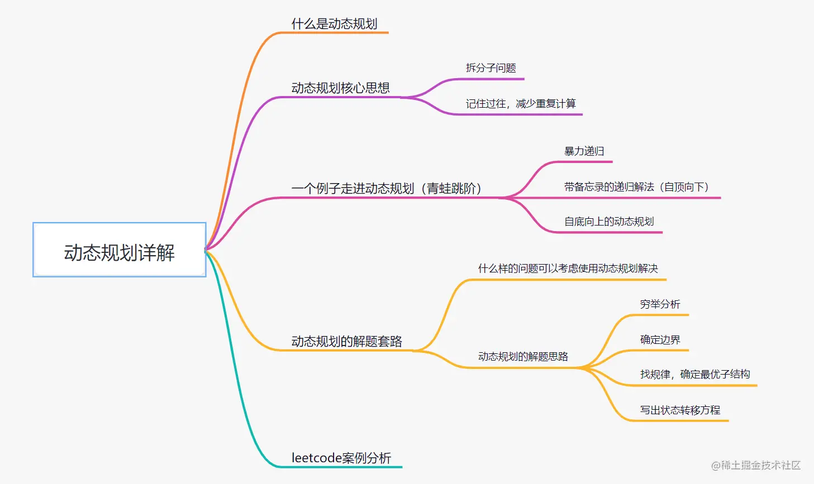

## Dynamic Programming

- ### 动态规划（Dynamic Programming）
    - 在你的面试中或许没有任何动态规划的问题，但能够知道一个题目可以使用动态规划来解决是很重要的。
    - 这一部分会有点困难，每个可以用动态规划解决的问题都必须先定义出递推关系，要推导出来可能会有点棘手。
    - 我建议先阅读和学习足够多的动态规划的例子，以便对解决 DP 问题的一般模式有个扎实的理解。
    - [ ] 视频:
        - Skiena 的视频可能会有点难跟上，有时候他用白板写的字会比较小，难看清楚。
        - [ ] [Skiena: CSE373 2012 - 课程 19 - 动态规划介绍（视频）](https://youtu.be/Qc2ieXRgR0k?list=PLOtl7M3yp-DV69F32zdK7YJcNXpTunF2b&t=1718)
        - [ ] [Skiena: CSE373 2012 - 课程 20 - 编辑距离（视频）](https://youtu.be/IsmMhMdyeGY?list=PLOtl7M3yp-DV69F32zdK7YJcNXpTunF2b&t=2749)
        - [ ] [Skiena: CSE373 2012 - 课程 21 - 动态规划举例（视频）](https://youtu.be/o0V9eYF4UI8?list=PLOtl7M3yp-DV69F32zdK7YJcNXpTunF2b&t=406)
        - [ ] [Skiena: CSE373 2012 - 课程 22 - 动态规划应用（视频）](https://www.youtube.com/watch?v=dRbMC1Ltl3A&list=PLOtl7M3yp-DV69F32zdK7YJcNXpTunF2b&index=22)
        - [ ] [Simonson: 动态规划 0 (starts at 59:18)（视频）](https://youtu.be/J5aJEcOr6Eo?list=PLFDnELG9dpVxQCxuD-9BSy2E7BWY3t5Sm&t=3558)
        - [ ] [Simonson: 动态规划 I - 课程 11（视频）](https://www.youtube.com/watch?v=0EzHjQ_SOeU&index=11&list=PLFDnELG9dpVxQCxuD-9BSy2E7BWY3t5Sm)
        - [ ] [Simonson: 动态规划 II - 课程 12（视频）](https://www.youtube.com/watch?v=v1qiRwuJU7g&list=PLFDnELG9dpVxQCxuD-9BSy2E7BWY3t5Sm&index=12)
        - [ ] 单独的 DP 问题 (每一个视频都很短)：[动态规划（视频）](https://www.youtube.com/playlist?list=PLrmLmBdmIlpsHaNTPP_jHHDx_os9ItYXr)
    - [ ] 耶鲁课程笔记:
        - [ ] [动态规划](http://www.cs.yale.edu/homes/aspnes/classes/223/notes.html#dynamicProgramming)
    - [ ] Coursera 课程:
        - [ ] [RNA 二级结构问题（视频）](https://www.coursera.org/learn/algorithmic-thinking-2/lecture/80RrW/the-rna-secondary-structure-problem)
        - [ ] [动态规划算法（视频）](https://www.coursera.org/learn/algorithmic-thinking-2/lecture/PSonq/a-dynamic-programming-algorithm)
        - [ ] [DP 算法描述（视频）](https://www.coursera.org/learn/algorithmic-thinking-2/lecture/oUEK2/illustrating-the-dp-algorithm)
        - [ ] [DP 算法的运行时间（视频）](https://www.coursera.org/learn/algorithmic-thinking-2/lecture/nfK2r/running-time-of-the-dp-algorithm)
        - [ ] [DP vs 递归实现（视频）](https://www.coursera.org/learn/algorithmic-thinking-2/lecture/M999a/dp-vs-recursive-implementation)
        - [ ] [全局成对序列排列（视频）](https://www.coursera.org/learn/algorithmic-thinking-2/lecture/UZ7o6/global-pairwise-sequence-alignment)
        - [ ] [本地成对序列排列（视频）](https://www.coursera.org/learn/algorithmic-thinking-2/lecture/WnNau/local-pairwise-sequence-alignment)

### 解释
